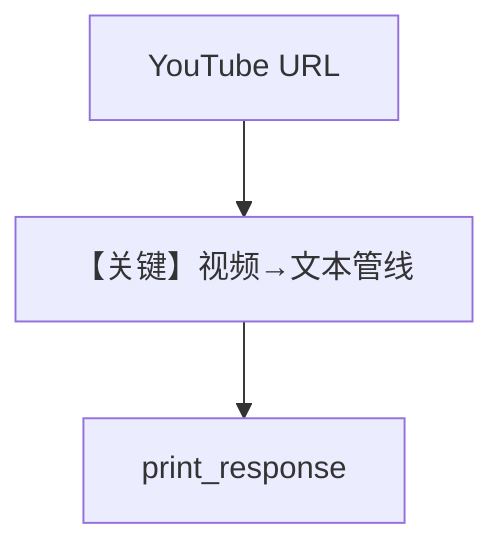

# from_youtube.py — 实现原理分析

<!-- cookbook-py-source:start -->
## 完整源码

```python
"""
From YouTube
============

Demonstrates loading knowledge from a YouTube URL using sync and async inserts.
"""

import asyncio

from agno.agent import Agent
from agno.knowledge.knowledge import Knowledge
from agno.vectordb.pgvector import PgVector

# ---------------------------------------------------------------------------
# Setup
# ---------------------------------------------------------------------------
vector_db = PgVector(
    table_name="vectors", db_url="postgresql+psycopg://ai:ai@localhost:5532/ai"
)


# ---------------------------------------------------------------------------
# Create Knowledge Base
# ---------------------------------------------------------------------------
def create_knowledge() -> Knowledge:
    return Knowledge(
        name="Basic SDK Knowledge Base",
        description="Agno 2.0 Knowledge Implementation",
        vector_db=vector_db,
    )


# ---------------------------------------------------------------------------
# Create Agent
# ---------------------------------------------------------------------------
def create_agent(knowledge: Knowledge) -> Agent:
    return Agent(
        name="My Agent",
        description="Agno 2.0 Agent Implementation",
        knowledge=knowledge,
        search_knowledge=True,
        debug_mode=True,
    )


# ---------------------------------------------------------------------------
# Run Agent
# ---------------------------------------------------------------------------
def run_sync() -> None:
    knowledge = create_knowledge()
    knowledge.insert(
        name="Agents from Scratch",
        url="https://www.youtube.com/watch?v=nLkBNnnA8Ac",
        metadata={"user_tag": "Youtube video"},
    )

    agent = create_agent(knowledge)
    agent.print_response(
        "What can you tell me about the building agents?",
        markdown=True,
    )


async def run_async() -> None:
    knowledge = create_knowledge()
    await knowledge.ainsert(
        name="Agents from Scratch",
        url="https://www.youtube.com/watch?v=nLkBNnnA8Ac",
        metadata={"user_tag": "Youtube video"},
    )

    agent = create_agent(knowledge)
    agent.print_response(
        "What can you tell me about the building agents?",
        markdown=True,
    )


if __name__ == "__main__":
    run_sync()
    asyncio.run(run_async())
```

<!-- cookbook-py-source:end -->

> 源文件：`cookbook/07_knowledge/09_archive/readers/from_youtube.py`

## 概述

**YouTube URL** 作为知识源 `insert`/`ainsert`，元数据标记 `user_tag`；`debug_mode=True`。

**核心配置一览：**

| 配置项 | 值 | 说明 |
|--------|-----|------|
| `url` | `youtube.com/watch?...` | 视频转录/抓取依赖 Reader 实现 |

## 核心组件解析

视频源通常先抽取音频/字幕再文本化，具体步骤由内置 YouTube 读取逻辑完成。

## System Prompt 组装

`description` + knowledge 块。

## 完整 API 请求

默认 `gpt-4o`。

## Mermaid 流程图



## 关键源码文件索引

| 文件 | 作用 |
|------|------|
| `agno/knowledge/knowledge.py` | URL 类型路由 |
