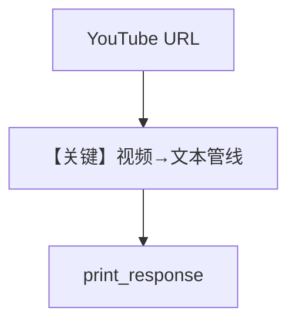

# from_youtube.py — 实现原理分析

> 源文件：`cookbook/07_knowledge/09_archive/readers/from_youtube.py`

## 概述

**YouTube URL** 作为知识源 `insert`/`ainsert`，元数据标记 `user_tag`；`debug_mode=True`。

**核心配置一览：**

| 配置项 | 值 | 说明 |
|--------|-----|------|
| `url` | `youtube.com/watch?...` | 视频转录/抓取依赖 Reader 实现 |

## 核心组件解析

视频源通常先抽取音频/字幕再文本化，具体步骤由内置 YouTube 读取逻辑完成。

## System Prompt 组装

`description` + knowledge 块。

## 完整 API 请求

默认 `gpt-4o`。

## Mermaid 流程图

## 关键源码文件索引

| 文件 | 作用 |
|------|------|
| `agno/knowledge/knowledge.py` | URL 类型路由 |
