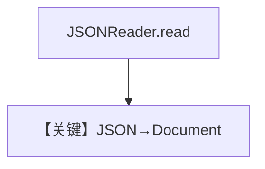

# json_reader.py — 实现原理分析

> 源文件：`cookbook/07_knowledge/09_archive/readers/json_reader.py`

## 概述

仅用 **`JSONReader.read(Path)`** 读本地 JSON，打印 `Document`；**无 Agent**。

**核心配置一览：**

| 配置项 | 值 | 说明 |
|--------|-----|------|
| `tmp/test.json` | 写入 `{"key":"value"}` | 自造测试数据 |

## 核心组件解析

`JSONReader` 将 JSON 序列化为可读文本块供下游嵌入使用。

## System Prompt 组装

无 LLM。

## 完整 API 请求

无。

## Mermaid 流程图

## 关键源码文件索引

| 文件 | 作用 |
|------|------|
| `agno/knowledge/reader/json_reader.py` | |
