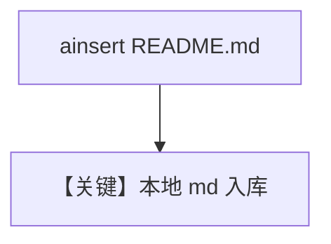

# markdown_reader_async.py — 实现原理分析

<!-- cookbook-py-source:start -->
## 完整源码

```python
import asyncio
from pathlib import Path

from agno.agent import Agent
from agno.knowledge.knowledge import Knowledge
from agno.vectordb.pgvector.pgvector import PgVector

db_url = "postgresql+psycopg://ai:ai@localhost:5532/ai"


knowledge = Knowledge(
    vector_db=PgVector(
        table_name="markdown_documents",
        db_url=db_url,
    ),
    max_results=5,  # Number of results to return on search
)

agent = Agent(
    knowledge=knowledge,
    search_knowledge=True,
)

if __name__ == "__main__":
    asyncio.run(
        knowledge.ainsert(
            path=Path("README.md"),
        )
    )

    asyncio.run(
        agent.aprint_response(
            "What can you tell me about Agno?",
            markdown=True,
        )
    )
```

<!-- cookbook-py-source:end -->

> 源文件：`cookbook/07_knowledge/09_archive/readers/markdown_reader_async.py`

## 概述

**注意**：从 **`agno.vectordb.pgvector.pgvector` 导入 `PgVector`**（子模块路径）；`ainsert(Path("README.md"))` 后 `aprint_response`。

**核心配置一览：**

| 配置项 | 值 | 说明 |
|--------|-----|------|
| `max_results` | `5` | |
| `README.md` | 相对仓库根 | 需从正确 cwd 运行 |

## 核心组件解析

本地 Markdown 直接分块入库，无需自定义 Reader 时使用默认 Markdown 处理。

## System Prompt 组装

默认 knowledge 块。

## 完整 API 请求

异步 Chat Completions。

## Mermaid 流程图



## 关键源码文件索引

| 文件 | 作用 |
|------|------|
| `agno/vectordb/pgvector/` | PgVector |
