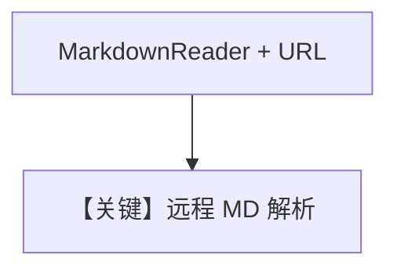

# md_reader_async.py — 实现原理分析

> 源文件：`cookbook/07_knowledge/09_archive/readers/md_reader_async.py`

## 概述

使用显式 **`MarkdownReader()`** 从 **GitHub 上 README 的 URL** 入库，再异步问答。

**核心配置一览：**

| 配置项 | 值 | 说明 |
|--------|-----|------|
| `reader` | `MarkdownReader()` | URL 内容当 Markdown 解析 |
| `ainsert` | `url=...github...README.md` | |

## 核心组件解析

与 `markdown_reader_async.py`（本地 Path）对比，本文件强调 **远程 Markdown URL + 专用 Reader**。

## System Prompt 组装

默认 knowledge 块。

## 完整 API 请求

异步 `gpt-4o`。

## Mermaid 流程图

## 关键源码文件索引

| 文件 | 作用 |
|------|------|
| `agno/knowledge/reader/markdown_reader.py` | |
