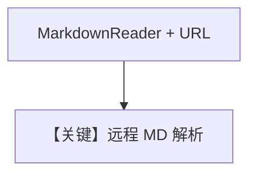

# md_reader_async.py — 实现原理分析

<!-- cookbook-py-source:start -->
## 完整源码

```python
import asyncio

from agno.agent import Agent
from agno.knowledge.knowledge import Knowledge
from agno.knowledge.reader.markdown_reader import MarkdownReader
from agno.vectordb.pgvector import PgVector

db_url = "postgresql+psycopg://ai:ai@localhost:5532/ai"

# Create a knowledge base with markdown content
knowledge = Knowledge(
    vector_db=PgVector(
        table_name="markdown_documents",
        db_url=db_url,
    )
)

# Create an agent with the knowledge base
agent = Agent(
    knowledge=knowledge,
    search_knowledge=True,
)

if __name__ == "__main__":
    asyncio.run(
        knowledge.ainsert(
            url="https://github.com/agno-agi/agno/blob/main/README.md",
            reader=MarkdownReader(),
        )
    )
    # Create and use the agent
    asyncio.run(
        agent.aprint_response(
            "What can you tell me about Agno?",
            markdown=True,
        )
    )
```

<!-- cookbook-py-source:end -->

> 源文件：`cookbook/07_knowledge/09_archive/readers/md_reader_async.py`

## 概述

使用显式 **`MarkdownReader()`** 从 **GitHub 上 README 的 URL** 入库，再异步问答。

**核心配置一览：**

| 配置项 | 值 | 说明 |
|--------|-----|------|
| `reader` | `MarkdownReader()` | URL 内容当 Markdown 解析 |
| `ainsert` | `url=...github...README.md` | |

## 核心组件解析

与 `markdown_reader_async.py`（本地 Path）对比，本文件强调 **远程 Markdown URL + 专用 Reader**。

## System Prompt 组装

默认 knowledge 块。

## 完整 API 请求

异步 `gpt-4o`。

## Mermaid 流程图



## 关键源码文件索引

| 文件 | 作用 |
|------|------|
| `agno/knowledge/reader/markdown_reader.py` | |
