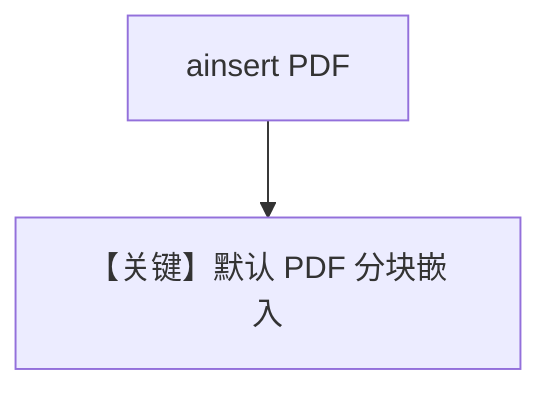

# pdf_reader_async.py — 实现原理分析

> 源文件：`cookbook/07_knowledge/09_archive/readers/pdf_reader_async.py`

## 概述

默认 PDF 管线：`ainsert(path=cv_1.pdf)`，无显式 **`PDFReader`**；`aprint_response` 问岗位要求。

**核心配置一览：**

| 配置项 | 值 | 说明 |
|--------|-----|------|
| `table_name` | `pdf_documents` | |

## 核心组件解析

依赖内置 PDF 读取与分块；密码 PDF 需另见 `pdf_reader_password.py`。

## System Prompt 组装

默认 knowledge 块。

## 完整 API 请求

异步 Chat Completions。

## Mermaid 流程图

## 关键源码文件索引

| 文件 | 作用 |
|------|------|
| `agno/knowledge/reader/pdf_reader.py` | 可选显式使用 |
