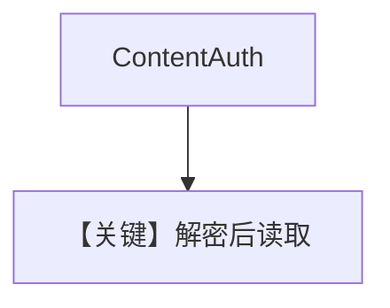

# pdf_reader_password.py — 实现原理分析

<!-- cookbook-py-source:start -->
## 完整源码

```python
from agno.agent import Agent
from agno.knowledge.content import ContentAuth
from agno.knowledge.knowledge import Knowledge
from agno.utils.media import download_file
from agno.vectordb.pgvector import PgVector

db_url = "postgresql+psycopg://ai:ai@localhost:5532/ai"
download_file(
    "https://agno-public.s3.us-east-1.amazonaws.com/recipes/ThaiRecipes_protected.pdf",
    "ThaiRecipes_protected.pdf",
)

# Create a knowledge base with simplified password handling
knowledge = Knowledge(
    vector_db=PgVector(
        table_name="pdf_documents_password",
        db_url=db_url,
    ),
)

knowledge.insert(
    path="ThaiRecipes_protected.pdf",
    auth=ContentAuth(password="ThaiRecipes"),
)

# Create an agent with the knowledge base
agent = Agent(
    knowledge=knowledge,
    search_knowledge=True,
)

agent.print_response("Give me the recipe for pad thai")
```

<!-- cookbook-py-source:end -->

> 源文件：`cookbook/07_knowledge/09_archive/readers/pdf_reader_password.py`

## 概述

**`ContentAuth(password=...)`** 解锁受密码 PDF；先 **`download_file`** 到本地再 `insert`；`print_response` 问 Pad Thai（非 markdown 参数）。

**核心配置一览：**

| 配置项 | 值 | 说明 |
|--------|-----|------|
| `auth` | `ContentAuth(password="ThaiRecipes")` | 与 PDF 密码一致 |
| `insert` | 本地路径 | |

## 核心组件解析

受保护 PDF 在解密前无法分块；`ContentAuth` 将密钥传入读取管线。

## System Prompt 组装

默认 knowledge 块；无 `markdown=True`。

## 完整 API 请求

默认 `gpt-4o`。

## Mermaid 流程图



## 关键源码文件索引

| 文件 | 作用 |
|------|------|
| `agno/knowledge/content.py` | `ContentAuth` |
