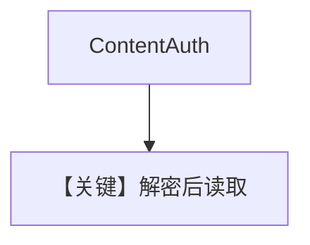

# pdf_reader_password.py — 实现原理分析

> 源文件：`cookbook/07_knowledge/09_archive/readers/pdf_reader_password.py`

## 概述

**`ContentAuth(password=...)`** 解锁受密码 PDF；先 **`download_file`** 到本地再 `insert`；`print_response` 问 Pad Thai（非 markdown 参数）。

**核心配置一览：**

| 配置项 | 值 | 说明 |
|--------|-----|------|
| `auth` | `ContentAuth(password="ThaiRecipes")` | 与 PDF 密码一致 |
| `insert` | 本地路径 | |

## 核心组件解析

受保护 PDF 在解密前无法分块；`ContentAuth` 将密钥传入读取管线。

## System Prompt 组装

默认 knowledge 块；无 `markdown=True`。

## 完整 API 请求

默认 `gpt-4o`。

## Mermaid 流程图

## 关键源码文件索引

| 文件 | 作用 |
|------|------|
| `agno/knowledge/content.py` | `ContentAuth` |
