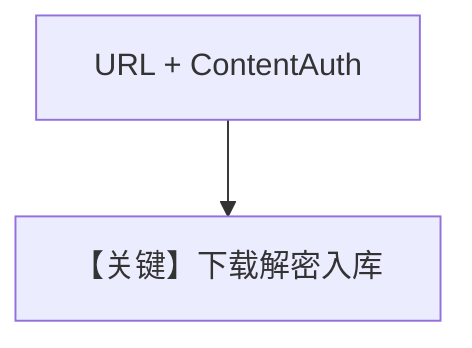

# pdf_reader_url_password.py — 实现原理分析

<!-- cookbook-py-source:start -->
## 完整源码

```python
from agno.agent import Agent
from agno.db.postgres.postgres import PostgresDb
from agno.knowledge.content import ContentAuth
from agno.knowledge.knowledge import Knowledge
from agno.vectordb.pgvector import PgVector

db_url = "postgresql+psycopg://ai:ai@localhost:5532/ai"

# Create a knowledge base with simplified password handling
knowledge = Knowledge(
    vector_db=PgVector(
        table_name="pdf_documents_password",
        db_url=db_url,
    ),
    contents_db=PostgresDb(db_url=db_url),
)

knowledge.insert(
    url="https://agno-public.s3.us-east-1.amazonaws.com/recipes/ThaiRecipes_protected.pdf",
    auth=ContentAuth(password="ThaiRecipes"),
)


# Create an agent with the knowledge
agent = Agent(
    knowledge=knowledge,
    search_knowledge=True,
)

agent.print_response("Give me the recipe for pad thai")
```

<!-- cookbook-py-source:end -->

> 源文件：`cookbook/07_knowledge/09_archive/readers/pdf_reader_url_password.py`

## 概述

**URL 直拉**受密码 PDF，**`ContentAuth`** + **`PostgresDb` contents_db**；同步 `print_response`。

**核心配置一览：**

| 配置项 | 值 | 说明 |
|--------|-----|------|
| `insert` | `url` + `auth` | 远程 + 密码 |

## 核心组件解析

与本地密码版相比，增加 **下载 + contents 持久化**。

## System Prompt 组装

默认 knowledge 块。

## 完整 API 请求

默认 `gpt-4o`。

## Mermaid 流程图



## 关键源码文件索引

| 文件 | 作用 |
|------|------|
| `agno/knowledge/knowledge.py` | URL insert |
