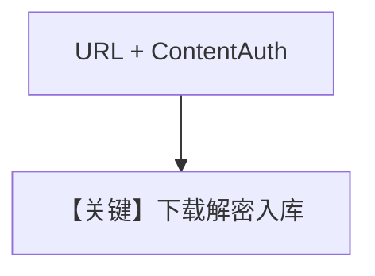

# pdf_reader_url_password.py — 实现原理分析

> 源文件：`cookbook/07_knowledge/09_archive/readers/pdf_reader_url_password.py`

## 概述

**URL 直拉**受密码 PDF，**`ContentAuth`** + **`PostgresDb` contents_db**；同步 `print_response`。

**核心配置一览：**

| 配置项 | 值 | 说明 |
|--------|-----|------|
| `insert` | `url` + `auth` | 远程 + 密码 |

## 核心组件解析

与本地密码版相比，增加 **下载 + contents 持久化**。

## System Prompt 组装

默认 knowledge 块。

## 完整 API 请求

默认 `gpt-4o`。

## Mermaid 流程图

## 关键源码文件索引

| 文件 | 作用 |
|------|------|
| `agno/knowledge/knowledge.py` | URL insert |
