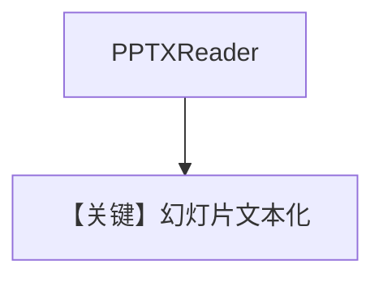

# pptx_reader.py — 实现原理分析

> 源文件：`cookbook/07_knowledge/09_archive/readers/pptx_reader.py`

## 概述

**`PPTXReader`** 读幻灯片；`insert` 使用占位路径 **`path/to/your/presentation.pptx`**（需用户替换）；**`OpenAIChat(id="gpt-5.2")`**。

**核心配置一览：**

| 配置项 | 值 | 说明 |
|--------|-----|------|
| `model` | `gpt-5.2` | 以源码为准 |
| `reader` | `PPTXReader()` | |

## 核心组件解析

PPTX 按幻灯片/备注抽取文本再分块。

## System Prompt 组装

无自定义 instructions；默认 knowledge 块。

## 完整 API 请求

`gpt-5.2` Chat Completions。

## Mermaid 流程图

## 关键源码文件索引

| 文件 | 作用 |
|------|------|
| `agno/knowledge/reader/pptx_reader.py` | |
