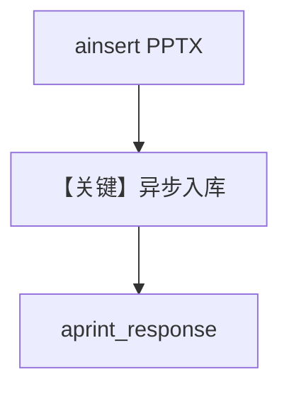

# pptx_reader_async.py — 实现原理分析

<!-- cookbook-py-source:start -->
## 完整源码

```python
import asyncio

from agno.agent import Agent
from agno.knowledge.knowledge import Knowledge
from agno.knowledge.reader.pptx_reader import PPTXReader
from agno.models.openai import OpenAIChat
from agno.vectordb.pgvector import PgVector

db_url = "postgresql+psycopg://ai:ai@localhost:5532/ai"

knowledge = Knowledge(
    # Table name: ai.pptx_documents
    vector_db=PgVector(
        table_name="pptx_documents",
        db_url=db_url,
    ),
)

# Create an agent with the knowledge
agent = Agent(
    model=OpenAIChat(id="gpt-5.2"),
    knowledge=knowledge,
    search_knowledge=True,
)


def main():
    # Load PPTX content from file(s) asynchronously
    # You can load multiple PPTX files by calling ainsert multiple times
    asyncio.run(
        knowledge.ainsert(
            path="path/to/your/presentation.pptx",  # Replace with actual PPTX file path
            reader=PPTXReader(),
        )
    )

    # Create and use the agent
    asyncio.run(
        agent.aprint_response(
            "Search through the presentation content and tell me what key topics, main points, or information are covered in the slides. Be specific about what you find in the knowledge base.",
            markdown=True,
        )
    )


if __name__ == "__main__":
    main()
```

<!-- cookbook-py-source:end -->

> 源文件：`cookbook/07_knowledge/09_archive/readers/pptx_reader_async.py`

## 概述

与 `pptx_reader.py` 相同的数据面（`PPTXReader` + `PgVector` + `gpt-5.2`），改用 **`knowledge.ainsert`** 与 **`agent.aprint_response`** 异步执行。

**核心配置一览：**

| 配置项 | 值 | 说明 |
|--------|-----|------|
| `ainsert` | `path` 占位 + `PPTXReader()` | 需替换真实路径 |
| `aprint_response` | 长提示，要求总结幻灯片要点 | |

## 核心组件解析

异步路径适合在 async Web 或已有 event loop 中嵌入。

## System Prompt 组装

默认 knowledge 块；无额外 `instructions`。

## 完整 API 请求

`OpenAIChat` 异步 `ainvoke`；模型 id `gpt-5.2`。

## Mermaid 流程图



## 关键源码文件索引

| 文件 | 作用 |
|------|------|
| `agno/knowledge/reader/pptx_reader.py` | |
