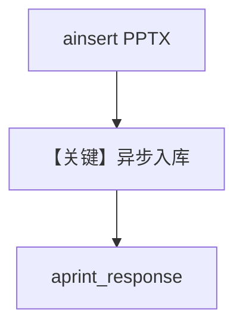

# pptx_reader_async.py — 实现原理分析

> 源文件：`cookbook/07_knowledge/09_archive/readers/pptx_reader_async.py`

## 概述

与 `pptx_reader.py` 相同的数据面（`PPTXReader` + `PgVector` + `gpt-5.2`），改用 **`knowledge.ainsert`** 与 **`agent.aprint_response`** 异步执行。

**核心配置一览：**

| 配置项 | 值 | 说明 |
|--------|-----|------|
| `ainsert` | `path` 占位 + `PPTXReader()` | 需替换真实路径 |
| `aprint_response` | 长提示，要求总结幻灯片要点 | |

## 核心组件解析

异步路径适合在 async Web 或已有 event loop 中嵌入。

## System Prompt 组装

默认 knowledge 块；无额外 `instructions`。

## 完整 API 请求

`OpenAIChat` 异步 `ainvoke`；模型 id `gpt-5.2`。

## Mermaid 流程图

## 关键源码文件索引

| 文件 | 作用 |
|------|------|
| `agno/knowledge/reader/pptx_reader.py` | |
