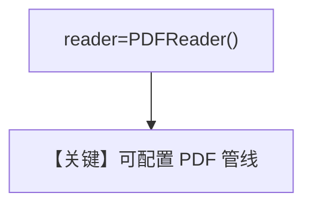

# specify_reader.py — 实现原理分析

<!-- cookbook-py-source:start -->
## 完整源码

```python
"""
Specify Reader
==============

Demonstrates setting a specific reader during knowledge insertion with sync and async APIs.
"""

import asyncio

from agno.agent import Agent
from agno.knowledge.knowledge import Knowledge
from agno.knowledge.reader.pdf_reader import PDFReader
from agno.vectordb.pgvector import PgVector

# ---------------------------------------------------------------------------
# Setup
# ---------------------------------------------------------------------------
vector_db = PgVector(
    table_name="vectors", db_url="postgresql+psycopg://ai:ai@localhost:5532/ai"
)


# ---------------------------------------------------------------------------
# Create Knowledge Base
# ---------------------------------------------------------------------------
def create_knowledge() -> Knowledge:
    return Knowledge(
        name="Basic SDK Knowledge Base",
        description="Agno 2.0 Knowledge Implementation",
        vector_db=vector_db,
    )


# ---------------------------------------------------------------------------
# Create Agent
# ---------------------------------------------------------------------------
def create_agent(knowledge: Knowledge) -> Agent:
    return Agent(knowledge=knowledge, search_knowledge=True)


# ---------------------------------------------------------------------------
# Run Agent
# ---------------------------------------------------------------------------
def run_sync() -> None:
    knowledge = create_knowledge()
    knowledge.insert(
        name="CV",
        path="cookbook/07_knowledge/testing_resources/cv_1.pdf",
        metadata={"user_tag": "Engineering Candidates"},
        reader=PDFReader(),
    )

    agent = create_agent(knowledge)
    agent.print_response("What can you tell me about my documents?", markdown=True)


async def run_async() -> None:
    knowledge = create_knowledge()
    await knowledge.ainsert(
        name="CV",
        path="cookbook/07_knowledge/testing_resources/cv_1.pdf",
        metadata={"user_tag": "Engineering Candidates"},
        reader=PDFReader(),
    )

    agent = create_agent(knowledge)
    agent.print_response(
        "What documents are in the knowledge base?",
        markdown=True,
    )


if __name__ == "__main__":
    run_sync()
    asyncio.run(run_async())
```

<!-- cookbook-py-source:end -->

> 源文件：`cookbook/07_knowledge/09_archive/readers/specify_reader.py`

## 概述

显式传入 **`PDFReader()`** 覆盖默认 PDF 处理；同步/异步对称；第二个异步问题改为「有哪些文档」。

**核心配置一览：**

| 配置项 | 值 | 说明 |
|--------|-----|------|
| `reader` | `PDFReader()` | 显式指定 |

## 核心组件解析

当需要调 **`chunk_size`**、解析选项等时，应显式构造 `PDFReader`。

## System Prompt 组装

默认 knowledge 块。

## 完整 API 请求

默认 `gpt-4o`。

## Mermaid 流程图



## 关键源码文件索引

| 文件 | 作用 |
|------|------|
| `agno/knowledge/reader/pdf_reader.py` | |
