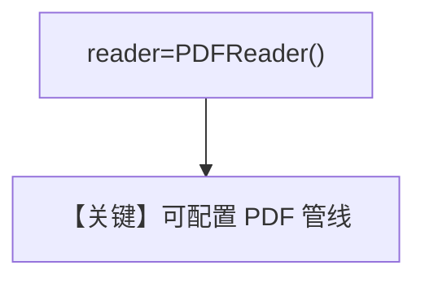

# specify_reader.py — 实现原理分析

> 源文件：`cookbook/07_knowledge/09_archive/readers/specify_reader.py`

## 概述

显式传入 **`PDFReader()`** 覆盖默认 PDF 处理；同步/异步对称；第二个异步问题改为「有哪些文档」。

**核心配置一览：**

| 配置项 | 值 | 说明 |
|--------|-----|------|
| `reader` | `PDFReader()` | 显式指定 |

## 核心组件解析

当需要调 **`chunk_size`**、解析选项等时，应显式构造 `PDFReader`。

## System Prompt 组装

默认 knowledge 块。

## 完整 API 请求

默认 `gpt-4o`。

## Mermaid 流程图

## 关键源码文件索引

| 文件 | 作用 |
|------|------|
| `agno/knowledge/reader/pdf_reader.py` | |
