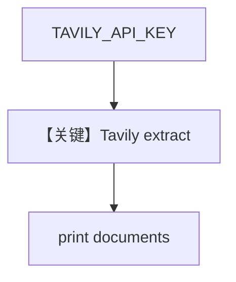

# tavily_reader.py — 实现原理分析

> 源文件：`cookbook/07_knowledge/09_archive/readers/tavily_reader.py`

## 概述

三组 **`TavilyReader`** 样例（basic/advanced/custom），仅用 **`reader.read(url)`** 打印文档；**无 Knowledge/Agent**；依赖 **`TAVILY_API_KEY`**。

**核心配置一览：**

| 配置项 | 值 | 说明 |
|--------|-----|------|
| `extract_format` / `extract_depth` | markdown/text, basic/advanced | 计费与质量权衡 |
| `chunk` / `chunk_size` | 分块策略 | |

## 核心组件解析

Tavily Extract API 将网页转为可嵌入文本；`chunk=True` 时多 Document。

## System Prompt 组装

无 LLM。

## 完整 API 请求

Tavily HTTP API；无 OpenAI。

## Mermaid 流程图

## 关键源码文件索引

| 文件 | 作用 |
|------|------|
| `agno/knowledge/reader/tavily_reader.py` | |
