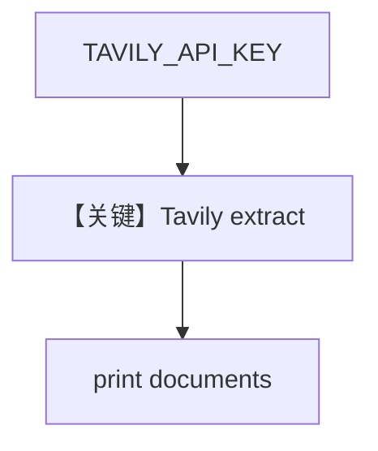

# tavily_reader.py — 实现原理分析

<!-- cookbook-py-source:start -->
## 完整源码

```python
import os

from agno.knowledge.reader.tavily_reader import TavilyReader

api_key = os.getenv("TAVILY_API_KEY")

# Example 1: Basic extraction with markdown format
print("=" * 80)
print("Example 1: Basic extraction (markdown, basic depth)")
print("=" * 80)

reader_basic = TavilyReader(
    api_key=api_key,
    extract_format="markdown",
    extract_depth="basic",  # 1 credit per 5 URLs
    chunk=True,
)

try:
    documents = reader_basic.read("https://github.com/agno-agi/agno")

    if documents:
        print(f"Extracted {len(documents)} document(s)")
        for doc in documents:
            print(f"\nDocument: {doc.name}")
            print(f"Content length: {len(doc.content)} characters")
            print(f"Content preview: {doc.content[:200]}...")
            print("-" * 80)
    else:
        print("No documents were returned")
except Exception as e:
    print(f"Error occurred: {str(e)}")


# Example 2: Advanced extraction with text format
print("\n" + "=" * 80)
print("Example 2: Advanced extraction (text, advanced depth)")
print("=" * 80)

reader_advanced = TavilyReader(
    api_key=api_key,
    extract_format="text",
    extract_depth="advanced",  # 2 credits per 5 URLs, more comprehensive
    chunk=False,  # Get full content without chunking
)

try:
    documents = reader_advanced.read(
        "https://docs.tavily.com/documentation/api-reference/endpoint/extract"
    )

    if documents:
        print(f"Extracted {len(documents)} document(s)")
        for doc in documents:
            print(f"\nDocument: {doc.name}")
            print(f"Content length: {len(doc.content)} characters")
            print(f"Content preview: {doc.content[:200]}...")
            print("-" * 80)
    else:
        print("No documents were returned")
except Exception as e:
    print(f"Error occurred: {str(e)}")


# Example 3: With custom parameters
print("\n" + "=" * 80)
print("Example 3: Custom parameters")
print("=" * 80)

reader_custom = TavilyReader(
    api_key=api_key,
    extract_format="markdown",
    extract_depth="basic",
    chunk=True,
    chunk_size=3000,  # Custom chunk size
    params={
        # Additional Tavily API parameters can be passed here
    },
)

try:
    documents = reader_custom.read("https://www.anthropic.com")

    if documents:
        print(f"Extracted {len(documents)} document(s) with custom chunk size")
        for doc in documents:
            print(f"\nDocument: {doc.name}")
            print(f"Content length: {len(doc.content)} characters")
            print("-" * 80)
    else:
        print("No documents were returned")
except Exception as e:
    print(f"Error occurred: {str(e)}")
```

<!-- cookbook-py-source:end -->

> 源文件：`cookbook/07_knowledge/09_archive/readers/tavily_reader.py`

## 概述

三组 **`TavilyReader`** 样例（basic/advanced/custom），仅用 **`reader.read(url)`** 打印文档；**无 Knowledge/Agent**；依赖 **`TAVILY_API_KEY`**。

**核心配置一览：**

| 配置项 | 值 | 说明 |
|--------|-----|------|
| `extract_format` / `extract_depth` | markdown/text, basic/advanced | 计费与质量权衡 |
| `chunk` / `chunk_size` | 分块策略 | |

## 核心组件解析

Tavily Extract API 将网页转为可嵌入文本；`chunk=True` 时多 Document。

## System Prompt 组装

无 LLM。

## 完整 API 请求

Tavily HTTP API；无 OpenAI。

## Mermaid 流程图



## 关键源码文件索引

| 文件 | 作用 |
|------|------|
| `agno/knowledge/reader/tavily_reader.py` | |
