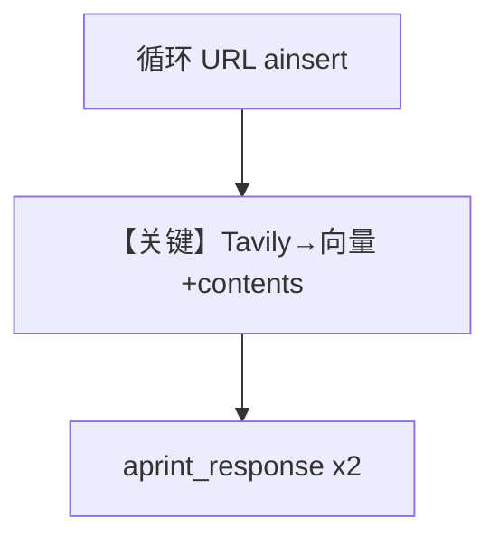

# tavily_reader_async.py — 实现原理分析

> 源文件：`cookbook/07_knowledge/09_archive/readers/tavily_reader_async.py`

## 概述

**`TavilyReader`** + **`PostgresDb` contents** + **`PgVector`**：循环 URL **`ainsert(url, reader=TavilyReader(...))`**，再 **`OpenAIChat(gpt-5.2)`** + **`debug_mode=True`** 两次 **`aprint_response`**。

**核心配置一览：**

| 配置项 | 值 | 说明 |
|--------|-----|------|
| `model` | `gpt-5.2` | |
| `TavilyReader` | extract_format/depth/chunk_size | 未传 api_key 时从环境读 |

## 核心组件解析

将纯 Reader 样例升级为 **完整 RAG**：Tavily 负责高质量网页正文，Knowledge 负责向量与 Agent 编排。

## System Prompt 组装

默认 knowledge 块。

## 完整 API 请求

- LLM：`gpt-5.2` Chat Completions（异步）。
- 嵌入/Tavily：按 Reader 与 Embedder 配置。

## Mermaid 流程图

## 关键源码文件索引

| 文件 | 作用 |
|------|------|
| `agno/knowledge/reader/tavily_reader.py` | |
