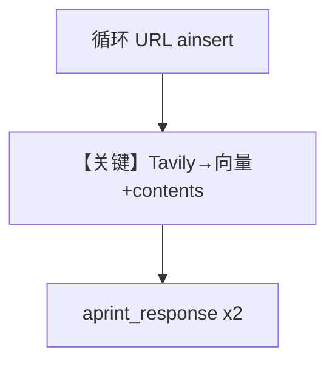

# tavily_reader_async.py — 实现原理分析

<!-- cookbook-py-source:start -->
## 完整源码

```python
import asyncio

from agno.agent import Agent
from agno.db.postgres.postgres import PostgresDb
from agno.knowledge.knowledge import Knowledge
from agno.knowledge.reader.tavily_reader import TavilyReader
from agno.models.openai import OpenAIChat
from agno.vectordb.pgvector import PgVector

db_url = "postgresql+psycopg://ai:ai@localhost:5532/ai"

# Initialize database and vector store
db = PostgresDb(id="tavily-reader-db", db_url=db_url)

vector_db = PgVector(
    db_url=db_url,
    table_name="tavily_documents",
)

knowledge = Knowledge(
    name="Tavily Extracted Documents",
    contents_db=db,
    vector_db=vector_db,
)


async def main():
    """
    Example demonstrating async TavilyReader usage with Knowledge base integration.

    This example shows:
    1. Adding content from URLs using TavilyReader asynchronously
    2. Integrating with Knowledge base for RAG
    3. Querying the agent with search_knowledge enabled
    """

    # URLs to extract content from
    urls_to_extract = [
        "https://github.com/agno-agi/agno",
        "https://docs.tavily.com/documentation/api-reference/endpoint/extract",
    ]

    print("=" * 80)
    print("Adding content to Knowledge base using TavilyReader (async)")
    print("=" * 80)

    # Add content from URLs using TavilyReader
    # Note: Comment out after first run to avoid re-adding the same content
    for url in urls_to_extract:
        print(f"\nExtracting content from: {url}")
        await knowledge.ainsert(
            url,
            reader=TavilyReader(
                extract_format="markdown",
                extract_depth="basic",
                chunk=True,
                chunk_size=3000,
            ),
        )

    print("\n" + "=" * 80)
    print("Creating Agent with Knowledge base")
    print("=" * 80)

    # Create an agent with the knowledge
    agent = Agent(
        model=OpenAIChat(id="gpt-5.2"),
        knowledge=knowledge,
        search_knowledge=True,  # Enable knowledge search
        debug_mode=True,
    )

    print("\n" + "=" * 80)
    print("Querying Agent")
    print("=" * 80)

    # Ask questions about the extracted content
    await agent.aprint_response(
        "What is Agno and what are its main features based on the documentation?",
        markdown=True,
    )

    print("\n" + "=" * 80)
    print("Second Query")
    print("=" * 80)

    await agent.aprint_response(
        "What is the Tavily Extract API and how does it work?",
        markdown=True,
    )


if __name__ == "__main__":
    # Run the async main function
    asyncio.run(main())
```

<!-- cookbook-py-source:end -->

> 源文件：`cookbook/07_knowledge/09_archive/readers/tavily_reader_async.py`

## 概述

**`TavilyReader`** + **`PostgresDb` contents** + **`PgVector`**：循环 URL **`ainsert(url, reader=TavilyReader(...))`**，再 **`OpenAIChat(gpt-5.2)`** + **`debug_mode=True`** 两次 **`aprint_response`**。

**核心配置一览：**

| 配置项 | 值 | 说明 |
|--------|-----|------|
| `model` | `gpt-5.2` | |
| `TavilyReader` | extract_format/depth/chunk_size | 未传 api_key 时从环境读 |

## 核心组件解析

将纯 Reader 样例升级为 **完整 RAG**：Tavily 负责高质量网页正文，Knowledge 负责向量与 Agent 编排。

## System Prompt 组装

默认 knowledge 块。

## 完整 API 请求

- LLM：`gpt-5.2` Chat Completions（异步）。
- 嵌入/Tavily：按 Reader 与 Embedder 配置。

## Mermaid 流程图



## 关键源码文件索引

| 文件 | 作用 |
|------|------|
| `agno/knowledge/reader/tavily_reader.py` | |
