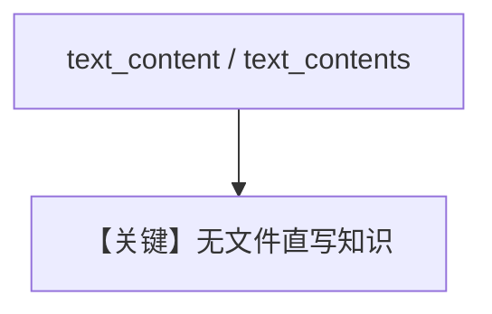

# text_content.py — 实现原理分析

<!-- cookbook-py-source:start -->
## 完整源码

```python
"""
Text Content
============

Demonstrates adding direct text content to knowledge using sync and async APIs.
"""

import asyncio

from agno.db.postgres.postgres import PostgresDb
from agno.knowledge.knowledge import Knowledge
from agno.vectordb.pgvector import PgVector

# ---------------------------------------------------------------------------
# Setup
# ---------------------------------------------------------------------------
contents_db = PostgresDb(
    db_url="postgresql+psycopg://ai:ai@localhost:5532/ai",
    knowledge_table="knowledge_contents",
)
vector_db = PgVector(
    table_name="vectors", db_url="postgresql+psycopg://ai:ai@localhost:5532/ai"
)


# ---------------------------------------------------------------------------
# Create Knowledge Base
# ---------------------------------------------------------------------------
def create_knowledge() -> Knowledge:
    return Knowledge(
        name="Basic SDK Knowledge Base",
        description="Agno 2.0 Knowledge Implementation",
        vector_db=vector_db,
        contents_db=contents_db,
    )


# ---------------------------------------------------------------------------
# Run Agent
# ---------------------------------------------------------------------------
def run_sync() -> None:
    knowledge = create_knowledge()
    knowledge.insert(
        name="Text Content",
        text_content="Cats and dogs are pets.",
        metadata={"user_tag": "Animals"},
    )

    knowledge.insert_many(
        name="Text Content",
        text_contents=["Cats and dogs are pets.", "Birds and fish are not pets."],
        metadata={"user_tag": "Animals"},
    )

    knowledge.insert_many(
        [
            {
                "text_content": "Cats and dogs are pets.",
                "metadata": {"user_tag": "Animals"},
            },
            {
                "text_content": "Birds and fish are not pets.",
                "metadata": {"user_tag": "Animals"},
            },
        ],
    )


async def run_async() -> None:
    knowledge = create_knowledge()
    await knowledge.ainsert(
        name="Text Content",
        text_content="Cats and dogs are pets.",
        metadata={"user_tag": "Animals"},
    )

    await knowledge.ainsert_many(
        name="Text Content",
        text_contents=["Cats and dogs are pets.", "Birds and fish are not pets."],
        metadata={"user_tag": "Animals"},
    )

    await knowledge.ainsert_many(
        [
            {
                "text_content": "Cats and dogs are pets.",
                "metadata": {"user_tag": "Animals"},
            },
            {
                "text_content": "Birds and fish are not pets.",
                "metadata": {"user_tag": "Animals"},
            },
        ],
    )


if __name__ == "__main__":
    run_sync()
    asyncio.run(run_async())
```

<!-- cookbook-py-source:end -->

> 源文件：`cookbook/07_knowledge/09_archive/readers/text_content.py`

## 概述

演示 **`text_content`** 与 **`text_contents`** 及 **`insert_many` 列表字典** 三种形态；**无 Agent**，仅入库。

**核心配置一览：**

| 配置项 | 值 | 说明 |
|--------|-----|------|
| `contents_db` + `PgVector` | 双存储 | |

## 核心组件解析

纯文本片段适合快速注入知识，无需文件。

## System Prompt 组装

无 Agent。

## 完整 API 请求

无 LLM。

## Mermaid 流程图



## 关键源码文件索引

| 文件 | 作用 |
|------|------|
| `agno/knowledge/knowledge.py` | `text_content` 参数 |
