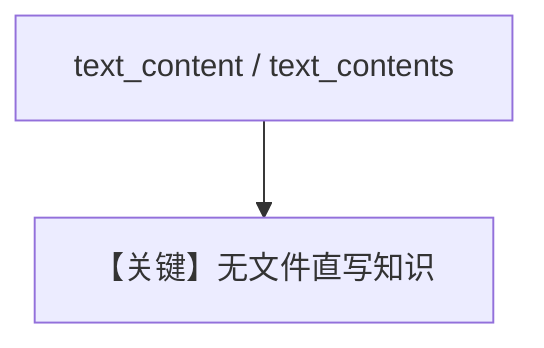

# text_content.py — 实现原理分析

> 源文件：`cookbook/07_knowledge/09_archive/readers/text_content.py`

## 概述

演示 **`text_content`** 与 **`text_contents`** 及 **`insert_many` 列表字典** 三种形态；**无 Agent**，仅入库。

**核心配置一览：**

| 配置项 | 值 | 说明 |
|--------|-----|------|
| `contents_db` + `PgVector` | 双存储 | |

## 核心组件解析

纯文本片段适合快速注入知识，无需文件。

## System Prompt 组装

无 Agent。

## 完整 API 请求

无 LLM。

## Mermaid 流程图

## 关键源码文件索引

| 文件 | 作用 |
|------|------|
| `agno/knowledge/knowledge.py` | `text_content` 参数 |
