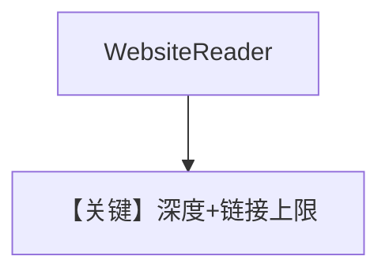

# web_reader.py — 实现原理分析

> 源文件：`cookbook/07_knowledge/09_archive/readers/web_reader.py`

## 概述

**`WebsiteReader(max_depth=3, max_links=10)`** 爬取 `docs.agno.com/introduction`，打印文档；**无 Agent**。

## 核心组件解析

站内跟随链接深度与数量受限，防止爬爆。

## System Prompt 组装

无 LLM。

## 完整 API 请求

仅 HTTP 抓取。

## Mermaid 流程图

## 关键源码文件索引

| 文件 | 作用 |
|------|------|
| `agno/knowledge/reader/website_reader.py` | |
