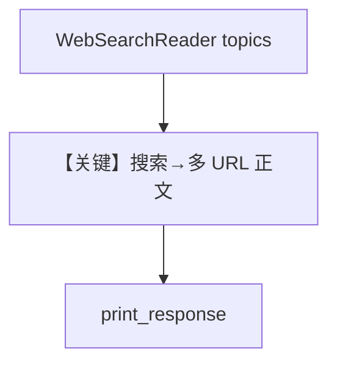

# web_search_reader.py — 实现原理分析

> 源文件：`cookbook/07_knowledge/09_archive/readers/web_search_reader.py`

## 概述

**`WebSearchReader`** 按 **topics** 用 DuckDuckGo 等抓取搜索结果再入库；**`PostgresDb` 带 id**；**`gpt-5.2`** + **`debug_mode=True`**。

**核心配置一览：**

| 配置项 | 值 | 说明 |
|--------|-----|------|
| `topics` | `["agno"]` | |
| `search_engine` | `duckduckgo` | |
| `max_results` | `3` | |

## 核心组件解析

主题 → 搜索 → 抓取页面 → 分块嵌入；适合「动态热点」类知识。

## System Prompt 组装

默认 knowledge 块。

## 完整 API 请求

`gpt-5.2` Chat Completions。

## Mermaid 流程图

## 关键源码文件索引

| 文件 | 作用 |
|------|------|
| `agno/knowledge/reader/web_search_reader.py` | |
