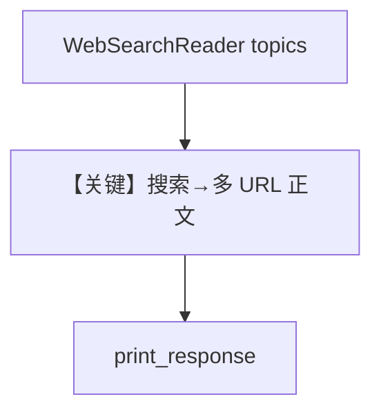

# web_search_reader.py — 实现原理分析

<!-- cookbook-py-source:start -->
## 完整源码

```python
from agno.agent import Agent
from agno.db.postgres.postgres import PostgresDb
from agno.knowledge.knowledge import Knowledge
from agno.knowledge.reader.web_search_reader import WebSearchReader
from agno.models.openai import OpenAIChat
from agno.vectordb.pgvector import PgVector

db_url = "postgresql+psycopg://ai:ai@localhost:5532/ai"


db = PostgresDb(id="web-search-db", db_url=db_url)

vector_db = PgVector(
    db_url=db_url,
    table_name="web_search_documents",
)
knowledge = Knowledge(
    name="Web Search Documents",
    contents_db=db,
    vector_db=vector_db,
)


# Load knowledge from web search
knowledge.insert(
    topics=["agno"],
    reader=WebSearchReader(
        max_results=3,
        search_engine="duckduckgo",
        chunk=True,
    ),
)

# Create an agent with the knowledge
agent = Agent(
    model=OpenAIChat(id="gpt-5.2"),
    knowledge=knowledge,
    search_knowledge=True,
    debug_mode=True,
)

# Ask the agent about the knowledge
agent.print_response(
    "What are the latest AI trends according to the search results?", markdown=True
)
```

<!-- cookbook-py-source:end -->

> 源文件：`cookbook/07_knowledge/09_archive/readers/web_search_reader.py`

## 概述

**`WebSearchReader`** 按 **topics** 用 DuckDuckGo 等抓取搜索结果再入库；**`PostgresDb` 带 id**；**`gpt-5.2`** + **`debug_mode=True`**。

**核心配置一览：**

| 配置项 | 值 | 说明 |
|--------|-----|------|
| `topics` | `["agno"]` | |
| `search_engine` | `duckduckgo` | |
| `max_results` | `3` | |

## 核心组件解析

主题 → 搜索 → 抓取页面 → 分块嵌入；适合「动态热点」类知识。

## System Prompt 组装

默认 knowledge 块。

## 完整 API 请求

`gpt-5.2` Chat Completions。

## Mermaid 流程图



## 关键源码文件索引

| 文件 | 作用 |
|------|------|
| `agno/knowledge/reader/web_search_reader.py` | |
