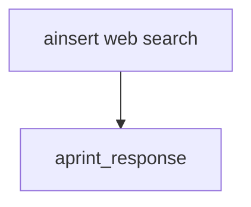

# web_search_reader_async.py — 实现原理分析

> 源文件：`cookbook/07_knowledge/09_archive/readers/web_search_reader_async.py`

## 概述

与同步版相同的 **`WebSearchReader`** + DB 配置；**`ainsert`** 主题改为 **web3**；**默认 `gpt-4o`**；**`aprint_response`**。

## 核心组件解析

异步适合长链路搜索与抓取。

## System Prompt 组装

默认 knowledge 块。

## 完整 API 请求

异步 Chat Completions。

## Mermaid 流程图

## 关键源码文件索引

| 文件 | 作用 |
|------|------|
| `agno/knowledge/reader/web_search_reader.py` | |
