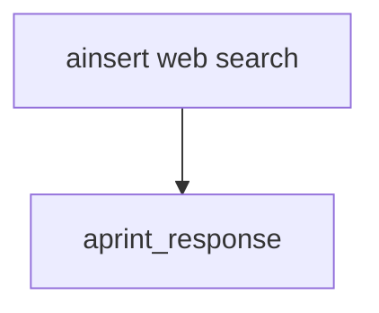

# web_search_reader_async.py — 实现原理分析

<!-- cookbook-py-source:start -->
## 完整源码

```python
import asyncio

from agno.agent import Agent
from agno.db.postgres.postgres import PostgresDb
from agno.knowledge.knowledge import Knowledge
from agno.knowledge.reader.web_search_reader import WebSearchReader
from agno.vectordb.pgvector import PgVector

db_url = "postgresql+psycopg://ai:ai@localhost:5532/ai"

db = PostgresDb(id="web-search-db", db_url=db_url)

vector_db = PgVector(
    db_url=db_url,
    table_name="web_search_documents",
)
knowledge = Knowledge(
    name="Web Search Documents",
    contents_db=db,
    vector_db=vector_db,
)


# Initialize the Agent with the knowledge
agent = Agent(
    knowledge=knowledge,
    search_knowledge=True,
)


if __name__ == "__main__":
    # Comment out after first run
    asyncio.run(
        knowledge.ainsert(
            topics=["web3 latest trends 2025"],
            reader=WebSearchReader(
                max_results=3,
                search_engine="duckduckgo",
                chunk=True,
            ),
        )
    )

    # Create and use the agent
    asyncio.run(
        agent.aprint_response(
            "What are the latest AI trends according to the search results?",
            markdown=True,
        )
    )
```

<!-- cookbook-py-source:end -->

> 源文件：`cookbook/07_knowledge/09_archive/readers/web_search_reader_async.py`

## 概述

与同步版相同的 **`WebSearchReader`** + DB 配置；**`ainsert`** 主题改为 **web3**；**默认 `gpt-4o`**；**`aprint_response`**。

## 核心组件解析

异步适合长链路搜索与抓取。

## System Prompt 组装

默认 knowledge 块。

## 完整 API 请求

异步 Chat Completions。

## Mermaid 流程图



## 关键源码文件索引

| 文件 | 作用 |
|------|------|
| `agno/knowledge/reader/web_search_reader.py` | |
