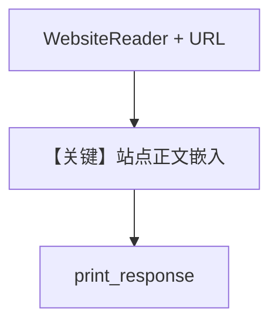

# website_reader.py — 实现原理分析

> 源文件：`cookbook/07_knowledge/09_archive/readers/website_reader.py`

## 概述

**`WebsiteReader`** 爬取维基 **OpenAI** 条目，**`OpenAIEmbedder()`** 配 **`PgVector`**，**`gpt-5.2`** 问答。

**核心配置一览：**

| 配置项 | 值 | 说明 |
|--------|-----|------|
| `embedder` | 显式 OpenAI | 嵌入与聊天分离配置 |
| `insert` | `url` + `reader=WebsiteReader()` | |

## 核心组件解析

单页深度爬取与 `web_reader` 的多链爬取形成对比。

## System Prompt 组装

默认 knowledge 块。

## 完整 API 请求

`gpt-5.2` + Embeddings API。

## Mermaid 流程图

## 关键源码文件索引

| 文件 | 作用 |
|------|------|
| `agno/knowledge/reader/website_reader.py` | |
