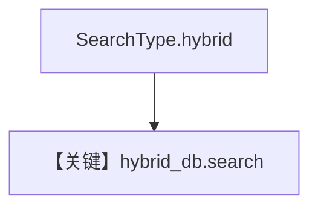

# hybrid_search.py — 实现原理分析

> 源文件：`cookbook/07_knowledge/09_archive/search_type/hybrid_search.py`

## 概述

**`PgVector(..., search_type=SearchType.hybrid)`**：插入食谱 PDF 后直接调用 **`hybrid_db.search(...)`** 打印结果；**无 Agent**，用于演示 **混合检索（向量 + 关键词融合）**。

**核心配置一览：**

| 配置项 | 值 | 说明 |
|--------|-----|------|
| `search_type` | `SearchType.hybrid` | 混合 |
| `Agent` | 无 | |

## 核心组件解析

混合检索在 pgvector 后端通常结合全文与向量分数（实现见 `PgVector.search`）。

## System Prompt 组装

无 LLM。

## 完整 API 请求

无聊天 API；仅有向 DB 的 search 调用。

## Mermaid 流程图

## 关键源码文件索引

| 文件 | 作用 |
|------|------|
| `agno/vectordb/pgvector/` | `SearchType` |
