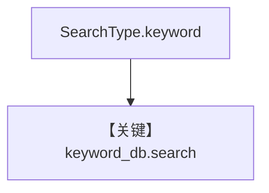

# keyword_search.py — 实现原理分析

> 源文件：`cookbook/07_knowledge/09_archive/search_type/keyword_search.py`

## 概述

**`SearchType.keyword`**：偏 **全文/关键词** 检索；插入后 `keyword_db.search` 打印。

**核心配置一览：**

| 配置项 | 值 | 说明 |
|--------|-----|------|
| `search_type` | `keyword` | |

## 核心组件解析

与 `vector_search.py` 对照理解同一表上不同检索模式。

## System Prompt 组装

无 Agent。

## 完整 API 请求

无。

## Mermaid 流程图

## 关键源码文件索引

| 文件 | 作用 |
|------|------|
| `agno/vectordb/pgvector/` | |
