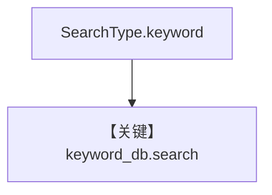

# keyword_search.py — 实现原理分析

<!-- cookbook-py-source:start -->
## 完整源码

```python
from agno.knowledge.knowledge import Knowledge
from agno.vectordb.pgvector import PgVector, SearchType

db_url = "postgresql+psycopg://ai:ai@localhost:5532/ai"

# Load knowledge base using keyword search
keyword_db = PgVector(
    table_name="recipes", db_url=db_url, search_type=SearchType.keyword
)
knowledge = Knowledge(
    name="Keyword Search Knowledge Base",
    vector_db=keyword_db,
)

knowledge.insert(
    url="https://agno-public.s3.amazonaws.com/recipes/ThaiRecipes.pdf",
)

# Run a keyword-based query
results = keyword_db.search("chicken coconut soup", limit=5)
print("Keyword Search Results:", results)
```

<!-- cookbook-py-source:end -->

> 源文件：`cookbook/07_knowledge/09_archive/search_type/keyword_search.py`

## 概述

**`SearchType.keyword`**：偏 **全文/关键词** 检索；插入后 `keyword_db.search` 打印。

**核心配置一览：**

| 配置项 | 值 | 说明 |
|--------|-----|------|
| `search_type` | `keyword` | |

## 核心组件解析

与 `vector_search.py` 对照理解同一表上不同检索模式。

## System Prompt 组装

无 Agent。

## 完整 API 请求

无。

## Mermaid 流程图



## 关键源码文件索引

| 文件 | 作用 |
|------|------|
| `agno/vectordb/pgvector/` | |
