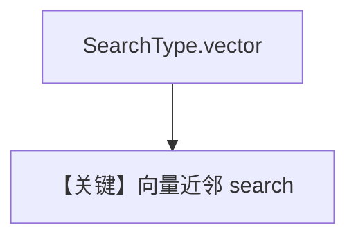

# vector_search.py — 实现原理分析

> 源文件：`cookbook/07_knowledge/09_archive/search_type/vector_search.py`

## 概述

**`SearchType.vector`**：纯 **语义向量** 近邻搜索；`vector_db.search` 打印。

## 核心组件解析

默认嵌入模型由 `PgVector`/全局默认决定；查询字符串经同一 embedder 向量化。

## System Prompt 组装

无 Agent。

## 完整 API 请求

无。

## Mermaid 流程图

## 关键源码文件索引

| 文件 | 作用 |
|------|------|
| `agno/vectordb/pgvector/` | |
