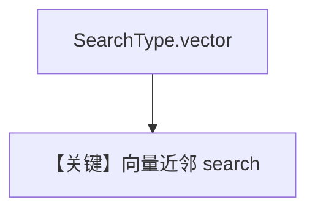

# vector_search.py — 实现原理分析

<!-- cookbook-py-source:start -->
## 完整源码

```python
from agno.knowledge.knowledge import Knowledge
from agno.vectordb.pgvector import PgVector, SearchType

db_url = "postgresql+psycopg://ai:ai@localhost:5532/ai"

# Load knowledge base using vector search
vector_db = PgVector(table_name="recipes", db_url=db_url, search_type=SearchType.vector)
knowledge = Knowledge(
    name="Vector Search Knowledge Base",
    vector_db=vector_db,
)

knowledge.insert(
    url="https://agno-public.s3.amazonaws.com/recipes/ThaiRecipes.pdf",
)

# Run a vector-based query
results = vector_db.search("chicken coconut soup", limit=5)
print("Vector Search Results:", results)
```

<!-- cookbook-py-source:end -->

> 源文件：`cookbook/07_knowledge/09_archive/search_type/vector_search.py`

## 概述

**`SearchType.vector`**：纯 **语义向量** 近邻搜索；`vector_db.search` 打印。

## 核心组件解析

默认嵌入模型由 `PgVector`/全局默认决定；查询字符串经同一 embedder 向量化。

## System Prompt 组装

无 Agent。

## 完整 API 请求

无。

## Mermaid 流程图



## 关键源码文件索引

| 文件 | 作用 |
|------|------|
| `agno/vectordb/pgvector/` | |
