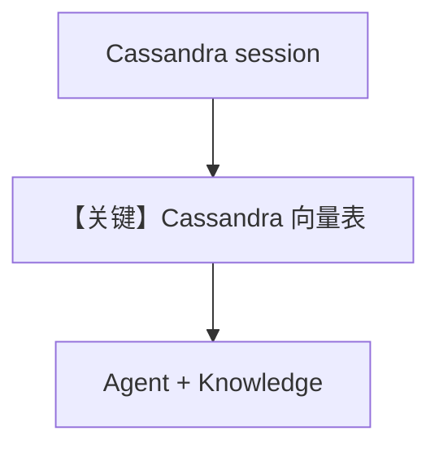

# cassandra_db.py — 实现原理分析

<!-- cookbook-py-source:start -->
## 完整源码

```python
"""
Cassandra Database
==================

Demonstrates Cassandra-backed knowledge with sync, async, and async-batching flows.

Requirement:
- uv pip install cassandra-driver
"""

import asyncio

from agno.agent import Agent
from agno.knowledge.embedder.mistral import MistralEmbedder
from agno.knowledge.embedder.openai import OpenAIEmbedder
from agno.knowledge.knowledge import Knowledge
from agno.models.mistral import MistralChat
from agno.vectordb.cassandra import Cassandra

try:
    from cassandra.cluster import Cluster  # type: ignore
except (ImportError, ModuleNotFoundError):
    raise ImportError(
        "Could not import cassandra-driver python package.Please install it with uv pip install cassandra-driver."
    )


# ---------------------------------------------------------------------------
# Setup
# ---------------------------------------------------------------------------
def create_session():
    cluster = Cluster()
    session = cluster.connect()
    session.execute(
        """
        CREATE KEYSPACE IF NOT EXISTS testkeyspace
        WITH REPLICATION = { 'class' : 'SimpleStrategy', 'replication_factor' : 1 }
        """
    )
    return session


# ---------------------------------------------------------------------------
# Create Knowledge Base
# ---------------------------------------------------------------------------
def create_sync_knowledge(session) -> tuple[Knowledge, Cassandra]:
    vector_db = Cassandra(
        table_name="recipes",
        keyspace="testkeyspace",
        session=session,
        embedder=OpenAIEmbedder(dimensions=1024),
    )
    knowledge = Knowledge(name="My Cassandra Knowledge Base", vector_db=vector_db)
    return knowledge, vector_db


def create_async_knowledge(session, enable_batch: bool = False) -> Knowledge:
    vector_db = Cassandra(
        table_name="recipes",
        keyspace="testkeyspace",
        session=session,
        embedder=MistralEmbedder(enable_batch=enable_batch),
    )
    return Knowledge(vector_db=vector_db)


# ---------------------------------------------------------------------------
# Create Agent
# ---------------------------------------------------------------------------
def create_sync_agent(knowledge: Knowledge) -> Agent:
    return Agent(knowledge=knowledge)


def create_async_agent(knowledge: Knowledge) -> Agent:
    return Agent(model=MistralChat(), knowledge=knowledge)


# ---------------------------------------------------------------------------
# Run Agent
# ---------------------------------------------------------------------------
def run_sync(session) -> None:
    knowledge, vector_db = create_sync_knowledge(session)
    knowledge.insert(
        name="Recipes",
        url="https://agno-public.s3.amazonaws.com/recipes/ThaiRecipes.pdf",
        metadata={"doc_type": "recipe_book"},
    )

    agent = create_sync_agent(knowledge)
    agent.print_response(
        "What are the health benefits of Khao Niew Dam Piek Maphrao Awn?",
        markdown=True,
        show_full_reasoning=True,
    )

    vector_db.delete_by_name("Recipes")
    vector_db.delete_by_metadata({"doc_type": "recipe_book"})


async def run_async(session, enable_batch: bool = False) -> None:
    knowledge = create_async_knowledge(session, enable_batch=enable_batch)
    agent = create_async_agent(knowledge)

    if enable_batch:
        await knowledge.ainsert(path="cookbook/07_knowledge/testing_resources/cv_1.pdf")
        await agent.aprint_response(
            "What can you tell me about the candidate?", markdown=True
        )
    else:
        await knowledge.ainsert(url="https://docs.agno.com/agents/overview.md")
        await agent.aprint_response(
            "What is the purpose of an Agno Agent?", markdown=True
        )


if __name__ == "__main__":
    cassandra_session = create_session()
    run_sync(cassandra_session)
    asyncio.run(run_async(cassandra_session, enable_batch=False))
    asyncio.run(run_async(cassandra_session, enable_batch=True))
```

<!-- cookbook-py-source:end -->

> 源文件：`cookbook/07_knowledge/09_archive/vector_dbs/cassandra_db.py`

## 概述

**`Cassandra`** 向量后端：本地 **`cassandra-driver`** 建 keyspace，**`OpenAIEmbedder`** / **`MistralEmbedder`**，同步与异步（含 batch）流程；依赖 JVM/Cassandra 或测试集群。

**核心配置一览：**

| 配置项 | 值 | 说明 |
|--------|-----|------|
| `Cassandra` | `table_name`, `keyspace`, `session`, `embedder` | |
| `create_session()` | `CREATE KEYSPACE IF NOT EXISTS` | |
| `create_sync_agent` | `Agent(knowledge=...)` | 默认 `gpt-4o` |
| `create_async_agent` | `Agent(model=MistralChat(), knowledge=...)` | Mistral Chat API |

## 核心组件解析

Cassandra 表存向量与元数据；`Cluster()` 连接本地或远程。

## System Prompt 组装

带 `Knowledge` 的 Agent 含默认 `<knowledge_base>` 段。

## 完整 API 请求

- 同步 Agent：未显式指定 `model` 时默认为 **`OpenAIChat(id="gpt-4o")`**（`set_default_model`）。
- 异步 Agent：显式 **`MistralChat()`**。
- 嵌入：`OpenAIEmbedder` / `MistralEmbedder`（见各 `Cassandra` 构造）。

## Mermaid 流程图



## 关键源码文件索引

| 文件 | 作用 |
|------|------|
| `agno/vectordb/cassandra/` | `Cassandra` |
