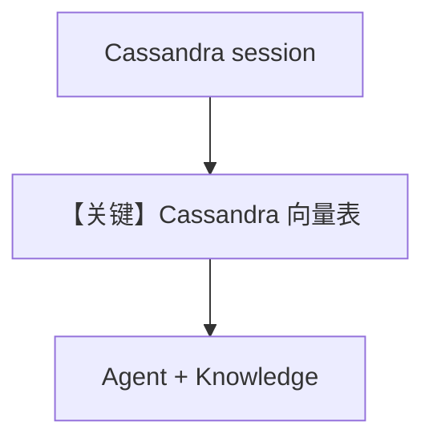

# cassandra_db.py — 实现原理分析

> 源文件：`cookbook/07_knowledge/09_archive/vector_dbs/cassandra_db.py`

## 概述

**`Cassandra`** 向量后端：本地 **`cassandra-driver`** 建 keyspace，**`OpenAIEmbedder`** / **`MistralEmbedder`**，同步与异步（含 batch）流程；依赖 JVM/Cassandra 或测试集群。

**核心配置一览：**

| 配置项 | 值 | 说明 |
|--------|-----|------|
| `Cassandra` | `table_name`, `keyspace`, `session`, `embedder` | |
| `create_session()` | `CREATE KEYSPACE IF NOT EXISTS` | |
| `create_sync_agent` | `Agent(knowledge=...)` | 默认 `gpt-4o` |
| `create_async_agent` | `Agent(model=MistralChat(), knowledge=...)` | Mistral Chat API |

## 核心组件解析

Cassandra 表存向量与元数据；`Cluster()` 连接本地或远程。

## System Prompt 组装

带 `Knowledge` 的 Agent 含默认 `<knowledge_base>` 段。

## 完整 API 请求

- 同步 Agent：未显式指定 `model` 时默认为 **`OpenAIChat(id="gpt-4o")`**（`set_default_model`）。
- 异步 Agent：显式 **`MistralChat()`**。
- 嵌入：`OpenAIEmbedder` / `MistralEmbedder`（见各 `Cassandra` 构造）。

## Mermaid 流程图

## 关键源码文件索引

| 文件 | 作用 |
|------|------|
| `agno/vectordb/cassandra/` | `Cassandra` |
