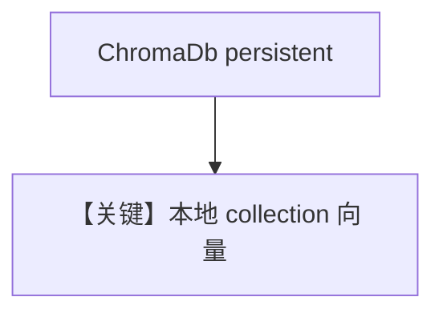

# chroma_db.py — 实现原理分析

> 源文件：`cookbook/07_knowledge/09_archive/vector_dbs/chroma_db.py`

## 概述

**`ChromaDb`** 本地持久化（`path=tmp/chromadb`），同步 / 异步 / **batch embed** 三路；适合无外部向量服务的开发环境。

**核心配置一览：**

| 配置项 | 值 | 说明 |
|--------|-----|------|
| `persistent_client` | `True` | 落盘 |
| `OpenAIEmbedder(enable_batch=True)` | 异步 batch 路径 | |

## 核心组件解析

Chroma 以 collection 隔离数据；`create_sync_agent` 默认仅 `knowledge=knowledge`。

## System Prompt 组装

默认 knowledge 段。

## 完整 API 请求

默认 `gpt-4o` + OpenAI Embeddings。

## Mermaid 流程图

## 关键源码文件索引

| 文件 | 作用 |
|------|------|
| `agno/vectordb/chroma/` | `ChromaDb` |
