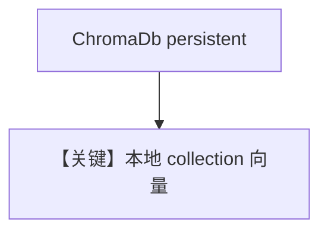

# chroma_db.py — 实现原理分析

<!-- cookbook-py-source:start -->
## 完整源码

```python
"""
Chroma Database
===============

Demonstrates Chroma-backed knowledge with sync, async, and async-batching flows.

Install dependency:
- uv pip install chromadb
"""

import asyncio

from agno.agent import Agent
from agno.knowledge.embedder.openai import OpenAIEmbedder
from agno.knowledge.knowledge import Knowledge
from agno.vectordb.chroma import ChromaDb


# ---------------------------------------------------------------------------
# Setup
# ---------------------------------------------------------------------------
def create_sync_knowledge() -> tuple[Knowledge, ChromaDb]:
    vector_db = ChromaDb(
        collection="vectors", path="tmp/chromadb", persistent_client=True
    )
    knowledge = Knowledge(
        name="Basic SDK Knowledge Base",
        description="Agno 2.0 Knowledge Implementation with ChromaDB",
        vector_db=vector_db,
    )
    return knowledge, vector_db


def create_async_knowledge(enable_batch: bool = False) -> Knowledge:
    if enable_batch:
        vector_db = ChromaDb(
            collection="recipes",
            path="tmp/chromadb",
            persistent_client=True,
            embedder=OpenAIEmbedder(enable_batch=True),
        )
    else:
        vector_db = ChromaDb(
            collection="recipes",
            path="tmp/chromadb",
            persistent_client=True,
        )
    return Knowledge(vector_db=vector_db)


# ---------------------------------------------------------------------------
# Create Agent
# ---------------------------------------------------------------------------
def create_agent(knowledge: Knowledge) -> Agent:
    return Agent(knowledge=knowledge)


# ---------------------------------------------------------------------------
# Run Agent
# ---------------------------------------------------------------------------
def run_sync() -> None:
    knowledge, vector_db = create_sync_knowledge()
    knowledge.insert(
        name="Recipes",
        url="https://agno-public.s3.amazonaws.com/recipes/ThaiRecipes.pdf",
        metadata={"doc_type": "recipe_book"},
    )

    agent = create_agent(knowledge)
    agent.print_response(
        "List down the ingredients to make Massaman Gai", markdown=True
    )

    vector_db.delete_by_name("Recipes")
    vector_db.delete_by_metadata({"doc_type": "recipe_book"})


async def run_async(enable_batch: bool = False) -> None:
    knowledge = create_async_knowledge(enable_batch=enable_batch)
    agent = create_agent(knowledge)

    if enable_batch:
        await knowledge.ainsert(path="cookbook/07_knowledge/testing_resources/cv_1.pdf")
    else:
        await knowledge.ainsert(url="https://docs.agno.com/agents/overview.md")

    await agent.aprint_response("What is the purpose of an Agno Agent?", markdown=True)


if __name__ == "__main__":
    run_sync()
    asyncio.run(run_async(enable_batch=False))
    asyncio.run(run_async(enable_batch=True))
```

<!-- cookbook-py-source:end -->

> 源文件：`cookbook/07_knowledge/09_archive/vector_dbs/chroma_db.py`

## 概述

**`ChromaDb`** 本地持久化（`path=tmp/chromadb`），同步 / 异步 / **batch embed** 三路；适合无外部向量服务的开发环境。

**核心配置一览：**

| 配置项 | 值 | 说明 |
|--------|-----|------|
| `persistent_client` | `True` | 落盘 |
| `OpenAIEmbedder(enable_batch=True)` | 异步 batch 路径 | |

## 核心组件解析

Chroma 以 collection 隔离数据；`create_sync_agent` 默认仅 `knowledge=knowledge`。

## System Prompt 组装

默认 knowledge 段。

## 完整 API 请求

默认 `gpt-4o` + OpenAI Embeddings。

## Mermaid 流程图



## 关键源码文件索引

| 文件 | 作用 |
|------|------|
| `agno/vectordb/chroma/` | `ChromaDb` |
