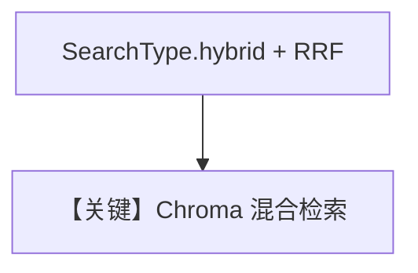

# chroma_db_hybrid_search.py — 实现原理分析

> 源文件：`cookbook/07_knowledge/09_archive/vector_dbs/chroma_db_hybrid_search.py`

## 概述

**`ChromaDb`** 配置 **`search_type=SearchType.hybrid`** 与 **`hybrid_rrf_k`**（RRF 融合）；`Knowledge` 设 **`max_results=10`**；`description` 为 **AgnoAssist** 长角色串，用于文档问答。

**核心配置一览：**

| 配置项 | 值 | 说明 |
|--------|-----|------|
| `embedder` | `OpenAIEmbedder(id="text-embedding-3-small")` | |
| `search_type` | `hybrid` | 向量+关键词 RRF |

## 核心组件解析

混合检索缓解纯语义漏关键词或纯关键词漏语义的问题。

## System Prompt 组装

`description`（dedent 多行）+ knowledge 块；若设置 `instructions` 见源码。

## 完整 API 请求

`OpenAIChat` + Embeddings。

## Mermaid 流程图

## 关键源码文件索引

| 文件 | 作用 |
|------|------|
| `agno/vectordb/chroma/` | `SearchType` |
