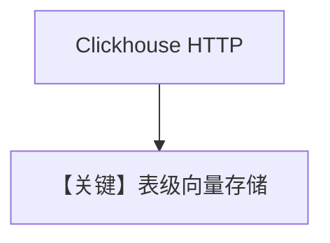

# clickhouse.py — 实现原理分析

<!-- cookbook-py-source:start -->
## 完整源码

```python
"""
ClickHouse Database
===================

Demonstrates ClickHouse-backed knowledge with sync, async, and async-batching flows.
"""

import asyncio

from agno.agent import Agent
from agno.knowledge.embedder.openai import OpenAIEmbedder
from agno.knowledge.knowledge import Knowledge
from agno.models.openai import OpenAIChat
from agno.vectordb.clickhouse import Clickhouse

# ---------------------------------------------------------------------------
# Setup
# ---------------------------------------------------------------------------
HOST = "localhost"
PORT = 8123
USERNAME = "ai"
PASSWORD = "ai"


# ---------------------------------------------------------------------------
# Create Knowledge Base
# ---------------------------------------------------------------------------
def create_sync_knowledge() -> tuple[Knowledge, Clickhouse]:
    vector_db = Clickhouse(
        table_name="recipe_documents",
        host=HOST,
        port=PORT,
        username=USERNAME,
        password=PASSWORD,
    )
    knowledge = Knowledge(
        name="My Clickhouse Knowledge Base",
        description="This is a knowledge base that uses a Clickhouse DB",
        vector_db=vector_db,
    )
    return knowledge, vector_db


def create_async_knowledge(enable_batch: bool = False) -> Knowledge:
    if enable_batch:
        vector_db = Clickhouse(
            table_name="documents",
            host=HOST,
            port=PORT,
            username=USERNAME,
            password=PASSWORD,
            embedder=OpenAIEmbedder(enable_batch=True),
        )
    else:
        vector_db = Clickhouse(
            table_name="documents",
            host=HOST,
            port=PORT,
            username=USERNAME,
            password=PASSWORD,
        )
    return Knowledge(vector_db=vector_db)


# ---------------------------------------------------------------------------
# Create Agent
# ---------------------------------------------------------------------------
def create_sync_agent(knowledge: Knowledge) -> Agent:
    return Agent(
        knowledge=knowledge,
        search_knowledge=True,
        read_chat_history=True,
    )


def create_async_agent(knowledge: Knowledge, enable_batch: bool = False) -> Agent:
    if enable_batch:
        return Agent(
            model=OpenAIChat(id="gpt-5.2"),
            knowledge=knowledge,
            search_knowledge=True,
            read_chat_history=True,
        )
    return Agent(
        knowledge=knowledge,
        search_knowledge=True,
        read_chat_history=True,
    )


# ---------------------------------------------------------------------------
# Run Agent
# ---------------------------------------------------------------------------
def run_sync() -> None:
    knowledge, vector_db = create_sync_knowledge()
    knowledge.insert(
        name="Recipes",
        url="https://agno-public.s3.amazonaws.com/recipes/ThaiRecipes.pdf",
        metadata={"doc_type": "recipe_book"},
    )

    agent = create_sync_agent(knowledge)
    agent.print_response("How do I make pad thai?", markdown=True)

    vector_db.delete_by_name("Recipes")
    vector_db.delete_by_metadata({"doc_type": "recipe_book"})


async def run_async(enable_batch: bool = False) -> None:
    knowledge = create_async_knowledge(enable_batch=enable_batch)
    agent = create_async_agent(knowledge, enable_batch=enable_batch)

    if enable_batch:
        await knowledge.ainsert(path="cookbook/07_knowledge/testing_resources/cv_1.pdf")
        await agent.aprint_response(
            "What can you tell me about the candidate and what are his skills?",
            markdown=True,
        )
    else:
        await knowledge.ainsert(url="https://docs.agno.com/agents/overview.md")
        await agent.aprint_response(
            "What is the purpose of an Agno Agent?", markdown=True
        )


if __name__ == "__main__":
    run_sync()
    asyncio.run(run_async(enable_batch=False))
    asyncio.run(run_async(enable_batch=True))
```

<!-- cookbook-py-source:end -->

> 源文件：`cookbook/07_knowledge/09_archive/vector_dbs/clickhouse.py`

## 概述

**`Clickhouse`** HTTP 端口连接，**`OpenAIEmbedder(enable_batch=True)`** 异步路径；同步 `create_sync_knowledge` 返回 `(Knowledge, Clickhouse)`。

**核心配置一览：**

| 配置项 | 值 | 说明 |
|--------|-----|------|
| `HOST`/`PORT`/`USERNAME`/`PASSWORD` | 默认 localhost:8123, ai/ai | |

## 核心组件解析

ClickHouse 适合分析型负载上的向量扩展；需服务预先可用。

## System Prompt 组装

默认 knowledge 段。

## 完整 API 请求

`OpenAIChat`（见 `create_async_agent`）。

## Mermaid 流程图



## 关键源码文件索引

| 文件 | 作用 |
|------|------|
| `agno/vectordb/clickhouse/` | |
