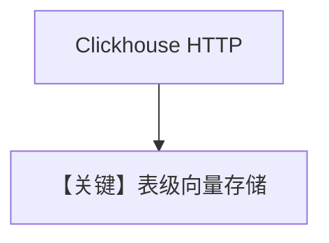

# clickhouse.py — 实现原理分析

> 源文件：`cookbook/07_knowledge/09_archive/vector_dbs/clickhouse.py`

## 概述

**`Clickhouse`** HTTP 端口连接，**`OpenAIEmbedder(enable_batch=True)`** 异步路径；同步 `create_sync_knowledge` 返回 `(Knowledge, Clickhouse)`。

**核心配置一览：**

| 配置项 | 值 | 说明 |
|--------|-----|------|
| `HOST`/`PORT`/`USERNAME`/`PASSWORD` | 默认 localhost:8123, ai/ai | |

## 核心组件解析

ClickHouse 适合分析型负载上的向量扩展；需服务预先可用。

## System Prompt 组装

默认 knowledge 段。

## 完整 API 请求

`OpenAIChat`（见 `create_async_agent`）。

## Mermaid 流程图

## 关键源码文件索引

| 文件 | 作用 |
|------|------|
| `agno/vectordb/clickhouse/` | |
