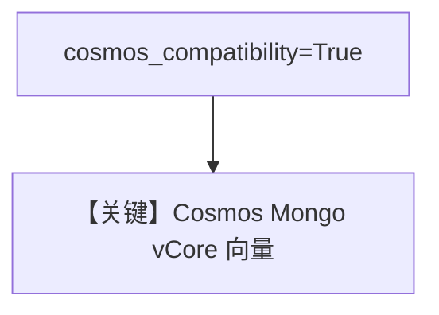

# cosmos_mongodb_vcore.py — 实现原理分析

<!-- cookbook-py-source:start -->
## 完整源码

```python
"""
Cosmos MongoDB vCore
====================

Demonstrates Cosmos DB (MongoDB vCore compatibility) as a vector DB backend.
"""

from agno.agent import Agent
from agno.knowledge.knowledge import Knowledge
from agno.vectordb.mongodb import MongoVectorDb

# ---------------------------------------------------------------------------
# Setup
# ---------------------------------------------------------------------------
mdb_connection_string = "mongodb+srv://<username>:<encoded_password>@cluster0.mongocluster.cosmos.azure.com/?tls=true&authMechanism=SCRAM-SHA-256&retrywrites=false&maxIdleTimeMS=120000"


# ---------------------------------------------------------------------------
# Create Knowledge Base
# ---------------------------------------------------------------------------
knowledge_base = Knowledge(
    vector_db=MongoVectorDb(
        collection_name="recipes",
        db_url=mdb_connection_string,
        search_index_name="recipes",
        cosmos_compatibility=True,
    ),
)


# ---------------------------------------------------------------------------
# Create Agent
# ---------------------------------------------------------------------------
agent = Agent(knowledge=knowledge_base)


# ---------------------------------------------------------------------------
# Run Agent
# ---------------------------------------------------------------------------
def main() -> None:
    knowledge_base.insert(
        url="https://agno-public.s3.amazonaws.com/recipes/ThaiRecipes.pdf"
    )
    agent.print_response("How to make Thai curry?", markdown=True)


if __name__ == "__main__":
    main()
```

<!-- cookbook-py-source:end -->

> 源文件：`cookbook/07_knowledge/09_archive/vector_dbs/cosmos_mongodb_vcore.py`

## 概述

**`MongoVectorDb`** 配 **`cosmos_compatibility=True`**，连接 **Azure Cosmos DB for MongoDB (vCore)** 向量能力；占位连接串需替换。

**核心配置一览：**

| 配置项 | 值 | 说明 |
|--------|-----|------|
| `search_index_name` | `recipes` | Atlas/Cosmos 搜索索引名 |

## 核心组件解析

与标准 Mongo Atlas 示例差异在 **Cosmos 兼容标志**，驱动连接串格式遵循 Azure。

## System Prompt 组装

`Agent(knowledge=knowledge_base)` 默认 knowledge 段。

## 完整 API 请求

默认 `gpt-4o`。

## Mermaid 流程图



## 关键源码文件索引

| 文件 | 作用 |
|------|------|
| `agno/vectordb/mongodb/` | `MongoVectorDb` |
