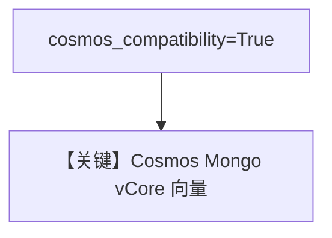

# cosmos_mongodb_vcore.py — 实现原理分析

> 源文件：`cookbook/07_knowledge/09_archive/vector_dbs/cosmos_mongodb_vcore.py`

## 概述

**`MongoVectorDb`** 配 **`cosmos_compatibility=True`**，连接 **Azure Cosmos DB for MongoDB (vCore)** 向量能力；占位连接串需替换。

**核心配置一览：**

| 配置项 | 值 | 说明 |
|--------|-----|------|
| `search_index_name` | `recipes` | Atlas/Cosmos 搜索索引名 |

## 核心组件解析

与标准 Mongo Atlas 示例差异在 **Cosmos 兼容标志**，驱动连接串格式遵循 Azure。

## System Prompt 组装

`Agent(knowledge=knowledge_base)` 默认 knowledge 段。

## 完整 API 请求

默认 `gpt-4o`。

## Mermaid 流程图

## 关键源码文件索引

| 文件 | 作用 |
|------|------|
| `agno/vectordb/mongodb/` | `MongoVectorDb` |
