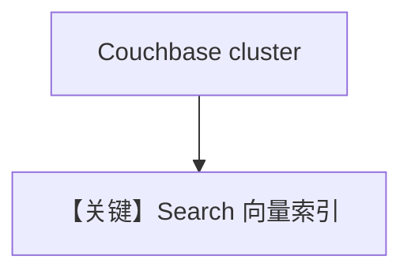

# couchbase_db.py — 实现原理分析

<!-- cookbook-py-source:start -->
## 完整源码

```python
"""
Couchbase Vector DB Example
==========================

Setup Couchbase Cluster (Local via Docker):
-------------------------------------------
1. Run Couchbase locally:

   docker run -d --name couchbase-server \
     -p 8091-8096:8091-8096 \
     -p 11210:11210 \
     -e COUCHBASE_ADMINISTRATOR_USERNAME=Administrator \
     -e COUCHBASE_ADMINISTRATOR_PASSWORD=password \
     couchbase:latest

2. Access the Couchbase UI at: http://localhost:8091
   (Login with the username and password above)

3. Create a new cluster. You can select "Finish with defaults".

4. Create a bucket named 'recipe_bucket', a scope 'recipe_scope', and a collection 'recipes'.

Managed Couchbase (Capella):
----------------------------
- For a managed cluster, use Couchbase Capella: https://cloud.couchbase.com/
- Follow Capella's UI to create a database, bucket, scope, and collection as above.

Environment Variables (export before running):
----------------------------------------------
Create a shell script (e.g., set_couchbase_env.sh):

    export COUCHBASE_USER="Administrator"
    export COUCHBASE_PASSWORD="password"
    export COUCHBASE_CONNECTION_STRING="couchbase://localhost"
    export OPENAI_API_KEY="<your-openai-api-key>"

# For Capella, set COUCHBASE_CONNECTION_STRING to the Capella connection string.

Install couchbase-sdk:
----------------------
    uv pip install couchbase
"""

import asyncio
import os
import time

from agno.agent import Agent
from agno.knowledge.embedder.openai import OpenAIEmbedder
from agno.knowledge.knowledge import Knowledge
from agno.vectordb.couchbase import CouchbaseSearch
from couchbase.auth import PasswordAuthenticator
from couchbase.management.search import SearchIndex
from couchbase.options import ClusterOptions, KnownConfigProfiles

# ---------------------------------------------------------------------------
# Setup
# ---------------------------------------------------------------------------
username = os.getenv("COUCHBASE_USER")
password = os.getenv("COUCHBASE_PASSWORD")
connection_string = os.getenv("COUCHBASE_CONNECTION_STRING")


def create_cluster_options() -> ClusterOptions:
    auth = PasswordAuthenticator(username, password)
    cluster_options = ClusterOptions(auth)
    cluster_options.apply_profile(KnownConfigProfiles.WanDevelopment)
    return cluster_options


def create_search_index(dims: int) -> SearchIndex:
    return SearchIndex(
        name="vector_search",
        source_type="gocbcore",
        idx_type="fulltext-index",
        source_name="recipe_bucket",
        plan_params={"index_partitions": 1, "num_replicas": 0},
        params={
            "doc_config": {
                "docid_prefix_delim": "",
                "docid_regexp": "",
                "mode": "scope.collection.type_field",
                "type_field": "type",
            },
            "mapping": {
                "default_analyzer": "standard",
                "default_datetime_parser": "dateTimeOptional",
                "index_dynamic": True,
                "store_dynamic": True,
                "default_mapping": {"dynamic": True, "enabled": False},
                "types": {
                    "recipe_scope.recipes": {
                        "dynamic": False,
                        "enabled": True,
                        "properties": {
                            "content": {
                                "enabled": True,
                                "fields": [
                                    {
                                        "docvalues": True,
                                        "include_in_all": False,
                                        "include_term_vectors": False,
                                        "index": True,
                                        "name": "content",
                                        "store": True,
                                        "type": "text",
                                    }
                                ],
                            },
                            "embedding": {
                                "enabled": True,
                                "dynamic": False,
                                "fields": [
                                    {
                                        "vector_index_optimized_for": "recall",
                                        "docvalues": True,
                                        "dims": dims,
                                        "include_in_all": False,
                                        "include_term_vectors": False,
                                        "index": True,
                                        "name": "embedding",
                                        "similarity": "dot_product",
                                        "store": True,
                                        "type": "vector",
                                    }
                                ],
                            },
                            "meta": {
                                "dynamic": True,
                                "enabled": True,
                                "properties": {
                                    "name": {
                                        "enabled": True,
                                        "fields": [
                                            {
                                                "docvalues": True,
                                                "include_in_all": False,
                                                "include_term_vectors": False,
                                                "index": True,
                                                "name": "name",
                                                "store": True,
                                                "analyzer": "keyword",
                                                "type": "text",
                                            }
                                        ],
                                    }
                                },
                            },
                        },
                    }
                },
            },
        },
    )


# ---------------------------------------------------------------------------
# Create Knowledge Base
# ---------------------------------------------------------------------------
def create_sync_knowledge() -> tuple[Knowledge, CouchbaseSearch]:
    vector_db = CouchbaseSearch(
        bucket_name="recipe_bucket",
        scope_name="recipe_scope",
        collection_name="recipes",
        couchbase_connection_string=connection_string,
        cluster_options=create_cluster_options(),
        search_index=create_search_index(dims=1536),
        embedder=OpenAIEmbedder(dimensions=1536),
        wait_until_index_ready=60,
        overwrite=True,
    )
    knowledge = Knowledge(
        name="Couchbase Knowledge Base",
        description="This is a knowledge base that uses a Couchbase DB",
        vector_db=vector_db,
    )
    return knowledge, vector_db


def create_async_knowledge(enable_batch: bool = False) -> Knowledge:
    vector_db = CouchbaseSearch(
        bucket_name="recipe_bucket",
        scope_name="recipe_scope",
        collection_name="recipes",
        couchbase_connection_string=connection_string,
        cluster_options=create_cluster_options(),
        search_index=create_search_index(dims=3072),
        embedder=OpenAIEmbedder(
            id="text-embedding-3-large",
            dimensions=3072,
            api_key=os.getenv("OPENAI_API_KEY"),
            enable_batch=enable_batch,
        ),
        wait_until_index_ready=60,
        overwrite=True,
    )
    if enable_batch:
        vector_db.drop()
    return Knowledge(vector_db=vector_db)


# ---------------------------------------------------------------------------
# Create Agent
# ---------------------------------------------------------------------------
def create_sync_agent(knowledge: Knowledge) -> Agent:
    return Agent(
        knowledge=knowledge,
        search_knowledge=True,
        read_chat_history=True,
    )


def create_async_agent(knowledge: Knowledge) -> Agent:
    return Agent(knowledge=knowledge)


# ---------------------------------------------------------------------------
# Run Agent
# ---------------------------------------------------------------------------
def run_sync() -> None:
    knowledge, vector_db = create_sync_knowledge()
    knowledge.insert(
        name="Recipes",
        url="https://agno-public.s3.amazonaws.com/recipes/ThaiRecipes.pdf",
        metadata={"doc_type": "recipe_book"},
    )

    agent = create_sync_agent(knowledge)
    agent.print_response(
        "List down the ingredients to make Massaman Gai", markdown=True
    )

    vector_db.delete_by_name("Recipes")
    vector_db.delete_by_metadata({"doc_type": "recipe_book"})


async def run_async(enable_batch: bool = False) -> None:
    knowledge = create_async_knowledge(enable_batch=enable_batch)
    agent = create_async_agent(knowledge)

    await knowledge.ainsert(
        url="https://agno-public.s3.amazonaws.com/recipes/ThaiRecipes.pdf"
    )
    time.sleep(5)
    await agent.aprint_response("How to make Thai curry?", markdown=True)


if __name__ == "__main__":
    run_sync()
    asyncio.run(run_async(enable_batch=False))
    asyncio.run(run_async(enable_batch=True))
```

<!-- cookbook-py-source:end -->

> 源文件：`cookbook/07_knowledge/09_archive/vector_dbs/couchbase_db.py`

## 概述

**`CouchbaseSearch`**：文档含 Docker 本地集群与 Capella 云上部署说明；需 **`couchbase`** SDK 与环境变量（用户/密码/连接串/`OPENAI_API_KEY`）；含 SearchIndex 管理逻辑（见完整 `.py`）。

**核心配置一览：**

| 配置项 | 值 | 说明 |
|--------|-----|------|
| `CouchbaseSearch` | bucket/scope/collection | 与 UI 建桶一致 |

## 核心组件解析

Couchbase 向量搜索依赖 FTS/向量索引创建；示例通常先建索引再插入。

## System Prompt 组装

带 Agent 时含 knowledge 段。

## 完整 API 请求

`OpenAIChat` + Embedder；Couchbase 为存储侧 HTTP/SDK。

## Mermaid 流程图



## 关键源码文件索引

| 文件 | 作用 |
|------|------|
| `agno/vectordb/couchbase/` | `CouchbaseSearch` |
