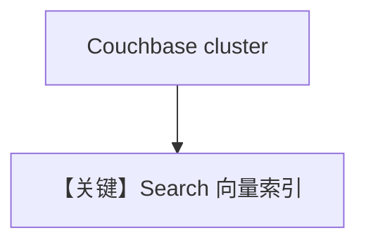

# couchbase_db.py — 实现原理分析

> 源文件：`cookbook/07_knowledge/09_archive/vector_dbs/couchbase_db.py`

## 概述

**`CouchbaseSearch`**：文档含 Docker 本地集群与 Capella 云上部署说明；需 **`couchbase`** SDK 与环境变量（用户/密码/连接串/`OPENAI_API_KEY`）；含 SearchIndex 管理逻辑（见完整 `.py`）。

**核心配置一览：**

| 配置项 | 值 | 说明 |
|--------|-----|------|
| `CouchbaseSearch` | bucket/scope/collection | 与 UI 建桶一致 |

## 核心组件解析

Couchbase 向量搜索依赖 FTS/向量索引创建；示例通常先建索引再插入。

## System Prompt 组装

带 Agent 时含 knowledge 段。

## 完整 API 请求

`OpenAIChat` + Embedder；Couchbase 为存储侧 HTTP/SDK。

## Mermaid 流程图

## 关键源码文件索引

| 文件 | 作用 |
|------|------|
| `agno/vectordb/couchbase/` | `CouchbaseSearch` |
