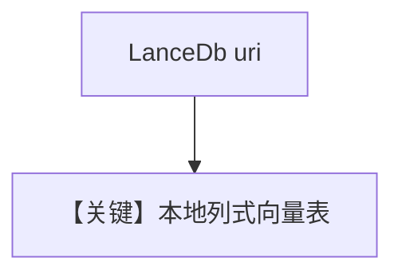

# lance_db.py — 实现原理分析

> 源文件：`cookbook/07_knowledge/09_archive/vector_dbs/lance_db.py`

## 概述

**`LanceDb`**：本地 **`tmp/lancedb`** 与 **`/tmp/lancedb`** 异步 batch；**`create_sync_agent`** 仅 knowledge；**`create_async_batch_agent`** 使用 **`OpenAIChat(id="gpt-5.2")`** + **`read_chat_history=True`**。

**核心配置一览：**

| 配置项 | 值 | 说明 |
|--------|-----|------|
| `enable_batch` | `OpenAIEmbedder(enable_batch=True)` | |
| `vector_db.delete_by_*` | sync 演示清理 | |

## 核心组件解析

Lance 列式格式适合本地大目录；`delete_by_name`/`delete_by_metadata` 演示清理 API。

## System Prompt 组装

默认 knowledge 段（`search_knowledge=True` 时）。

## 完整 API 请求

`gpt-5.2` / 默认 `gpt-4o` 视分支而定。

## Mermaid 流程图

## 关键源码文件索引

| 文件 | 作用 |
|------|------|
| `agno/vectordb/lancedb/` | `LanceDb` |
