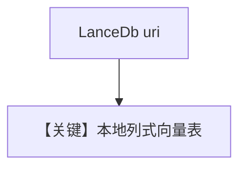

# lance_db.py — 实现原理分析

<!-- cookbook-py-source:start -->
## 完整源码

```python
"""
LanceDB Database
================

Demonstrates LanceDB-backed knowledge with sync and async-batching flows.
"""

import asyncio

from agno.agent import Agent
from agno.knowledge.embedder.openai import OpenAIEmbedder
from agno.knowledge.knowledge import Knowledge
from agno.models.openai import OpenAIChat
from agno.vectordb.lancedb import LanceDb


# ---------------------------------------------------------------------------
# Setup
# ---------------------------------------------------------------------------
def create_sync_knowledge() -> tuple[Knowledge, LanceDb]:
    vector_db = LanceDb(table_name="vectors", uri="tmp/lancedb")
    knowledge = Knowledge(
        name="Basic SDK Knowledge Base",
        description="Agno 2.0 Knowledge Implementation with LanceDB",
        vector_db=vector_db,
    )
    return knowledge, vector_db


def create_async_batch_knowledge() -> Knowledge:
    return Knowledge(
        vector_db=LanceDb(
            uri="/tmp/lancedb",
            table_name="recipe_documents",
            embedder=OpenAIEmbedder(enable_batch=True),
        )
    )


# ---------------------------------------------------------------------------
# Create Agent
# ---------------------------------------------------------------------------
def create_sync_agent(knowledge: Knowledge) -> Agent:
    return Agent(knowledge=knowledge)


def create_async_batch_agent(knowledge: Knowledge) -> Agent:
    return Agent(
        model=OpenAIChat(id="gpt-5.2"),
        knowledge=knowledge,
        search_knowledge=True,
        read_chat_history=True,
    )


# ---------------------------------------------------------------------------
# Run Agent
# ---------------------------------------------------------------------------
def run_sync() -> None:
    knowledge, vector_db = create_sync_knowledge()
    knowledge.insert(
        name="Recipes",
        url="https://agno-public.s3.amazonaws.com/recipes/ThaiRecipes.pdf",
        metadata={"doc_type": "recipe_book"},
    )

    agent = create_sync_agent(knowledge)
    agent.print_response(
        "List down the ingredients to make Massaman Gai", markdown=True
    )

    vector_db.delete_by_name("Recipes")
    vector_db.delete_by_metadata({"doc_type": "recipe_book"})


async def run_async_batch() -> None:
    knowledge = create_async_batch_knowledge()
    agent = create_async_batch_agent(knowledge)

    await knowledge.ainsert(path="cookbook/07_knowledge/testing_resources/cv_1.pdf")
    await agent.aprint_response(
        "What can you tell me about the candidate and what are his skills?",
        markdown=True,
    )


if __name__ == "__main__":
    run_sync()
    asyncio.run(run_async_batch())
```

<!-- cookbook-py-source:end -->

> 源文件：`cookbook/07_knowledge/09_archive/vector_dbs/lance_db.py`

## 概述

**`LanceDb`**：本地 **`tmp/lancedb`** 与 **`/tmp/lancedb`** 异步 batch；**`create_sync_agent`** 仅 knowledge；**`create_async_batch_agent`** 使用 **`OpenAIChat(id="gpt-5.2")`** + **`read_chat_history=True`**。

**核心配置一览：**

| 配置项 | 值 | 说明 |
|--------|-----|------|
| `enable_batch` | `OpenAIEmbedder(enable_batch=True)` | |
| `vector_db.delete_by_*` | sync 演示清理 | |

## 核心组件解析

Lance 列式格式适合本地大目录；`delete_by_name`/`delete_by_metadata` 演示清理 API。

## System Prompt 组装

默认 knowledge 段（`search_knowledge=True` 时）。

## 完整 API 请求

`gpt-5.2` / 默认 `gpt-4o` 视分支而定。

## Mermaid 流程图



## 关键源码文件索引

| 文件 | 作用 |
|------|------|
| `agno/vectordb/lancedb/` | `LanceDb` |
