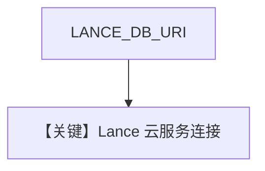

# lance_db_cloud.py — 实现原理分析

<!-- cookbook-py-source:start -->
## 完整源码

```python
"""
LanceDB Cloud connection test.

Requires environment variables:
- LANCE_DB_URI: LanceDB Cloud database URI (e.g. db://your-database-id)
- LANCE_DB_API_KEY or LANCEDB_API_KEY: LanceDB Cloud API key

Run from repo root with env loaded (e.g. direnv):
  .venvs/demo/bin/python cookbook/07_knowledge/vector_db/lance_db_cloud/lance_db_cloud.py
"""

import asyncio
import os

from agno.knowledge.knowledge import Knowledge
from agno.vectordb.lancedb import LanceDb

# ---------------------------------------------------------------------------
# Setup
# ---------------------------------------------------------------------------
TABLE_NAME = "agno_cloud_test"
URI = os.getenv("LANCE_DB_URI")
API_KEY = os.getenv("LANCE_DB_API_KEY") or os.getenv("LANCEDB_API_KEY")


# ---------------------------------------------------------------------------
# Create Knowledge Base
# ---------------------------------------------------------------------------
# The cloud vector DB and knowledge instance are created inside `main()`
# after validating required environment variables.


# ---------------------------------------------------------------------------
# Run Agent
# ---------------------------------------------------------------------------
def main():
    if not URI:
        print("Set LANCE_DB_URI (e.g. db://your-database-id)")
        return

    # ---------------------------------------------------------------------------
    # Create Knowledge Base
    # ---------------------------------------------------------------------------
    vector_db = LanceDb(
        uri=URI,
        table_name=TABLE_NAME,
        api_key=API_KEY,
    )

    knowledge = Knowledge(
        name="LanceDB Cloud Test",
        description="Agno Knowledge with LanceDB Cloud",
        vector_db=vector_db,
    )

    async def run():
        print("Inserting test content...")
        await knowledge.ainsert(
            name="cloud_test_doc",
            text_content="LanceDB Cloud is a hosted vector database. "
            "Agno supports it via the LanceDb vector store with uri and api_key. "
            "Use db:// URI and set LANCEDB_API_KEY for cloud connections.",
            metadata={"source": "lance_db_cloud_cookbook"},
        )

        print("Searching for 'vector database'...")
        results = knowledge.search("vector database", max_results=3)
        print(f"Found {len(results)} document(s)")
        for i, doc in enumerate(results):
            print(f"  [{i + 1}] {doc.name}: {doc.content[:80]}...")

        print("Deleting test document...")
        vector_db.delete_by_name("cloud_test_doc")
        print("Done.")

    asyncio.run(run())


if __name__ == "__main__":
    main()
```

<!-- cookbook-py-source:end -->

> 源文件：`cookbook/07_knowledge/09_archive/vector_dbs/lance_db_cloud.py`

## 概述

**LanceDB Cloud**：依赖 **`LANCE_DB_URI`** 与 **`LANCE_DB_API_KEY`/`LANCEDB_API_KEY`**；无 env 时 **提前 return**，不创建 Knowledge。

**核心配置一览：**

| 配置项 | 值 | 说明 |
|--------|-----|------|
| `LanceDb(uri, api_key=...)` | 云端 | |

## 核心组件解析

云 URI 形如 `db://...`；与本地 `uri=tmp/lancedb` 对照。

## System Prompt 组装

若仅测连通可能无 Agent；若补全问答则含 knowledge 段。

## 完整 API 请求

视脚本是否调用 Agent 而定。

## Mermaid 流程图



## 关键源码文件索引

| 文件 | 作用 |
|------|------|
| `agno/vectordb/lancedb/` | 云端参数 |
