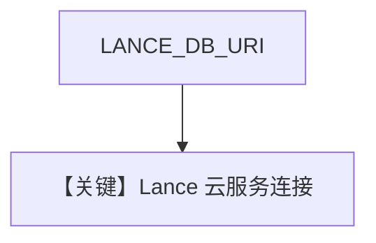

# lance_db_cloud.py — 实现原理分析

> 源文件：`cookbook/07_knowledge/09_archive/vector_dbs/lance_db_cloud.py`

## 概述

**LanceDB Cloud**：依赖 **`LANCE_DB_URI`** 与 **`LANCE_DB_API_KEY`/`LANCEDB_API_KEY`**；无 env 时 **提前 return**，不创建 Knowledge。

**核心配置一览：**

| 配置项 | 值 | 说明 |
|--------|-----|------|
| `LanceDb(uri, api_key=...)` | 云端 | |

## 核心组件解析

云 URI 形如 `db://...`；与本地 `uri=tmp/lancedb` 对照。

## System Prompt 组装

若仅测连通可能无 Agent；若补全问答则含 knowledge 段。

## 完整 API 请求

视脚本是否调用 Agent 而定。

## Mermaid 流程图

## 关键源码文件索引

| 文件 | 作用 |
|------|------|
| `agno/vectordb/lancedb/` | 云端参数 |
