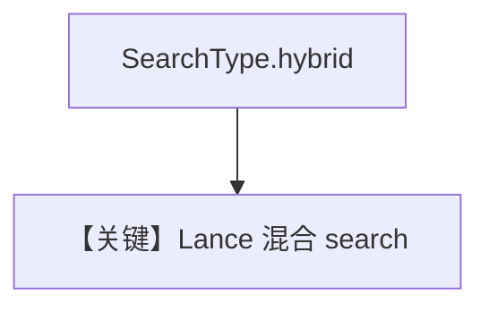

# lance_db_hybrid_search.py — 实现原理分析

> 源文件：`cookbook/07_knowledge/09_archive/vector_dbs/lance_db_hybrid_search.py`

## 概述

**`LanceDb`** + **`SearchType.hybrid`**；**`OpenAIChat(id="gpt-4o")`**，`markdown=True`，`insert` 食谱 PDF 后流式 `print_response`。

**核心配置一览：**

| 配置项 | 值 | 说明 |
|--------|-----|------|
| `stream` | `True` | 流式输出 |

## 核心组件解析

Lance 混合检索在 `search_type=hybrid` 下组合稀疏/稠密（实现见 LanceDb）。

## System Prompt 组装

默认 knowledge 段。

## 完整 API 请求

`gpt-4o` 流式 Chat Completions。

## Mermaid 流程图

## 关键源码文件索引

| 文件 | 作用 |
|------|------|
| `agno/vectordb/lancedb/` | `SearchType` |
