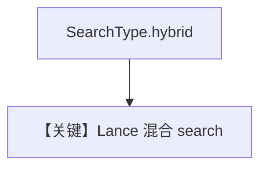

# lance_db_hybrid_search.py — 实现原理分析

<!-- cookbook-py-source:start -->
## 完整源码

```python
"""
LanceDB Hybrid Search
=====================

Demonstrates hybrid search with LanceDB.
"""

from agno.agent import Agent
from agno.knowledge.knowledge import Knowledge
from agno.models.openai import OpenAIChat
from agno.vectordb.lancedb import LanceDb, SearchType

# ---------------------------------------------------------------------------
# Setup
# ---------------------------------------------------------------------------
vector_db = LanceDb(
    table_name="vectors",
    uri="tmp/lancedb",
    search_type=SearchType.hybrid,
)


# ---------------------------------------------------------------------------
# Create Knowledge Base
# ---------------------------------------------------------------------------
knowledge = Knowledge(
    name="My LanceDB Knowledge Base",
    description="This is a knowledge base that uses LanceDB",
    vector_db=vector_db,
)


# ---------------------------------------------------------------------------
# Create Agent
# ---------------------------------------------------------------------------
agent = Agent(
    model=OpenAIChat(id="gpt-4o"),
    knowledge=knowledge,
    search_knowledge=True,
    markdown=True,
)


# ---------------------------------------------------------------------------
# Run Agent
# ---------------------------------------------------------------------------
def main() -> None:
    knowledge.insert(
        name="Recipes",
        url="https://agno-public.s3.amazonaws.com/recipes/ThaiRecipes.pdf",
        metadata={"doc_type": "recipe_book"},
    )
    agent.print_response(
        "How do I make chicken and galangal in coconut milk soup",
        stream=True,
    )


if __name__ == "__main__":
    main()
```

<!-- cookbook-py-source:end -->

> 源文件：`cookbook/07_knowledge/09_archive/vector_dbs/lance_db_hybrid_search.py`

## 概述

**`LanceDb`** + **`SearchType.hybrid`**；**`OpenAIChat(id="gpt-4o")`**，`markdown=True`，`insert` 食谱 PDF 后流式 `print_response`。

**核心配置一览：**

| 配置项 | 值 | 说明 |
|--------|-----|------|
| `stream` | `True` | 流式输出 |

## 核心组件解析

Lance 混合检索在 `search_type=hybrid` 下组合稀疏/稠密（实现见 LanceDb）。

## System Prompt 组装

默认 knowledge 段。

## 完整 API 请求

`gpt-4o` 流式 Chat Completions。

## Mermaid 流程图



## 关键源码文件索引

| 文件 | 作用 |
|------|------|
| `agno/vectordb/lancedb/` | `SearchType` |
